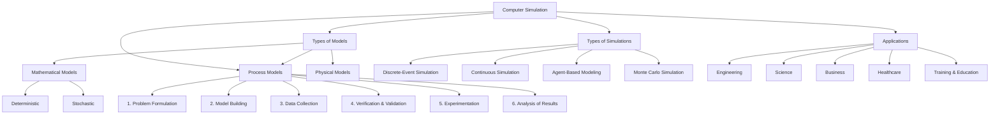

```mermaid
flowchart TD
    CSim[Computer Simulation] --> Models[Types of Models]
    CSim --> SimTypes[Types of Simulations]
    CSim --> Process[Simulation Process]
    CSim --> Applications[Applications]

    Models --> Mathematical[Mathematical Models]
    Models --> Physical[Physical Models]
    Models --> Process[Process Models]

    Mathematical --> Deterministic[Deterministic]
    Mathematical --> Stochastic[Stochastic]

    SimTypes --> Discrete[Discrete-Event Simulation]
    SimTypes --> Continuous[Continuous Simulation]
    SimTypes --> AgentBased[Agent-Based Modeling]
    SimTypes --> MonteCarlo[Monte Carlo Simulation]

    Process --> Problem[1. Problem Formulation]
    Process --> Model[2. Model Building]
    Process --> Data[3. Data Collection]
    Process --> Verification[4. Verification & Validation]
    Process --> Experiment[5. Experimentation]
    Process --> Analysis[6. Analysis of Results]

    Applications --> Engineering[Engineering]
    Applications --> Science[Science]
    Applications --> Business[Business]
    Applications --> Healthcare[Healthcare]
    Applications --> Training[Training & Education]
```
