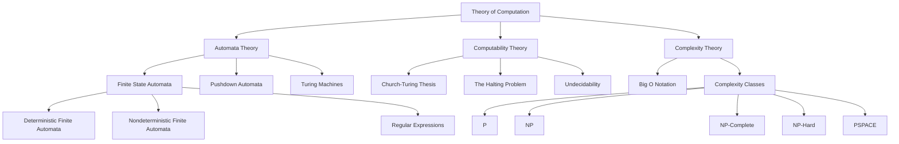

```mermaid
flowchart TD
    ToC[Theory of Computation] --> Automata[Automata Theory]
    ToC --> Computability[Computability Theory]
    ToC --> Complexity[Complexity Theory]

    Automata --> FSA[Finite State Automata]
    Automata --> PDA[Pushdown Automata]
    Automata --> TM[Turing Machines]

    FSA --> DFA[Deterministic Finite Automata]
    FSA --> NFA[Nondeterministic Finite Automata]
    FSA --> Regex[Regular Expressions]

    Computability --> ChurchTuring[Church-Turing Thesis]
    Computability --> Halting[The Halting Problem]
    Computability --> Undecidability[Undecidability]

    Complexity --> BigO[Big O Notation]
    Complexity --> Classes[Complexity Classes]

    Classes --> P[P]
    Classes --> NP[NP]
    Classes --> NPComplete[NP-Complete]
    Classes --> NPHard[NP-Hard]
    Classes --> PSPACE[PSPACE]
```
