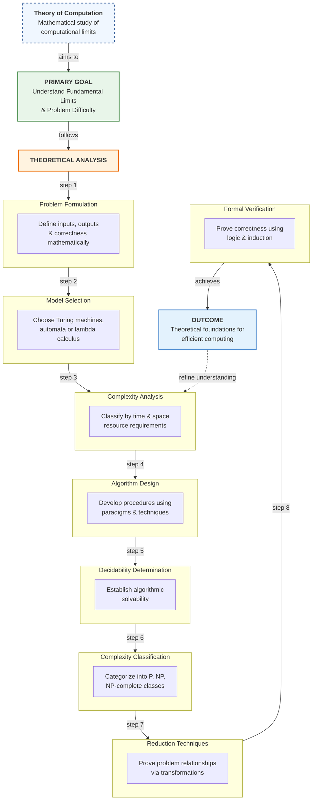

```mermaid
flowchart TD
    A[<b>Theory of Computation</b><br>Mathematical study of<br>computational limits]:::title
    B[<b>PRIMARY GOAL</b><br>Understand Fundamental Limits<br>& Problem Difficulty]:::goal
    C[<b>THEORETICAL ANALYSIS</b>]:::process
    
    subgraph D[Problem Formulation]
        D1[Define inputs, outputs<br>& correctness mathematically]
    end
    
    subgraph E[Model Selection]
        E1[Choose Turing machines,<br>automata or lambda calculus]
    end
    
    subgraph F[Complexity Analysis]
        F1[Classify by time & space<br>resource requirements]
    end
    
    subgraph G[Algorithm Design]
        G1[Develop procedures using<br>paradigms & techniques]
    end
    
    subgraph H[Decidability Determination]
        H1[Establish algorithmic<br>solvability]
    end
    
    subgraph I[Complexity Classification]
        I1[Categorize into P, NP,<br>NP-complete classes]
    end
    
    subgraph J[Reduction Techniques]
        J1[Prove problem relationships<br>via transformations]
    end
    
    subgraph K[Formal Verification]
        K1[Prove correctness using<br>logic & induction]
    end
    
    L[<b>OUTCOME</b><br>Theoretical foundations for<br>efficient computing]:::outcome
    
    A -->|aims to| B
    B -->|follows| C
    C -->|step 1| D
    D -->|step 2| E
    E -->|step 3| F
    F -->|step 4| G
    G -->|step 5| H
    H -->|step 6| I
    I -->|step 7| J
    J -->|step 8| K
    K -->|achieves| L
    L -.->|refine understanding| F
    
    classDef title fill:#f0f7ff,stroke:#4a6fa5,stroke-width:2px,color:#333,stroke-dasharray:5 5
    classDef goal fill:#e8f5e9,stroke:#2e7d32,stroke-width:2px,color:#333
    classDef process fill:#fff3e0,stroke:#ef6c00,stroke-width:2px,color:#333
    classDef outcome fill:#e3f2fd,stroke:#1565c0,stroke-width:2px,color:#333
```
