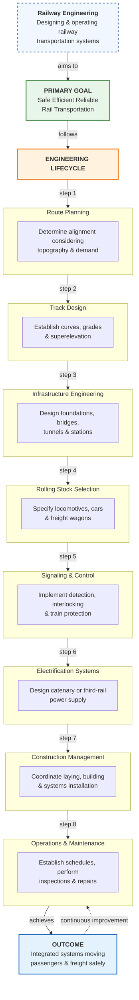

```mermaid
flowchart TD
    A[<b>Railway Engineering</b><br>Designing & operating railway<br>transportation systems]:::title
    B[<b>PRIMARY GOAL</b><br>Safe Efficient Reliable<br>Rail Transportation]:::goal
    C[<b>ENGINEERING LIFECYCLE</b>]:::process
    
    subgraph D[Route Planning]
        D1[Determine alignment considering<br>topography & demand]
    end
    
    subgraph E[Track Design]
        E1[Establish curves, grades<br>& superelevation]
    end
    
    subgraph F[Infrastructure Engineering]
        F1[Design foundations, bridges,<br>tunnels & stations]
    end
    
    subgraph G[Rolling Stock Selection]
        G1[Specify locomotives, cars<br>& freight wagons]
    end
    
    subgraph H[Signaling & Control]
        H1[Implement detection, interlocking<br>& train protection]
    end
    
    subgraph I[Electrification Systems]
        I1[Design catenary or third-rail<br>power supply]
    end
    
    subgraph J[Construction Management]
        J1[Coordinate laying, building<br>& systems installation]
    end
    
    subgraph K[Operations & Maintenance]
        K1[Establish schedules, perform<br>inspections & repairs]
    end
    
    L[<b>OUTCOME</b><br>Integrated systems moving<br>passengers & freight safely]:::outcome
    
    A -->|aims to| B
    B -->|follows| C
    C -->|step 1| D
    D -->|step 2| E
    E -->|step 3| F
    F -->|step 4| G
    G -->|step 5| H
    H -->|step 6| I
    I -->|step 7| J
    J -->|step 8| K
    K -->|achieves| L
    L -.->|continuous improvement| K
    
    classDef title fill:#f0f7ff,stroke:#4a6fa5,stroke-width:2px,color:#333,stroke-dasharray:5 5
    classDef goal fill:#e8f5e9,stroke:#2e7d32,stroke-width:2px,color:#333
    classDef process fill:#fff3e0,stroke:#ef6c00,stroke-width:2px,color:#333
    classDef outcome fill:#e3f2fd,stroke:#1565c0,stroke-width:2px,color:#333
```