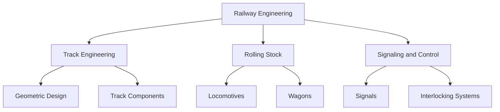

```mermaid
flowchart TD
    RailwayEngineering[Railway Engineering] --> Track[Track Engineering]
    RailwayEngineering --> RollingStock[Rolling Stock]
    RailwayEngineering --> Signaling[Signaling and Control]
    Track --> Alignment[Geometric Design]
    Track --> Components[Track Components]
    RollingStock --> Locomotives[Locomotives]
    RollingStock --> Wagons[Wagons]
    Signaling --> Signals[Signals]
    Signaling --> Interlocking[Interlocking Systems]
```