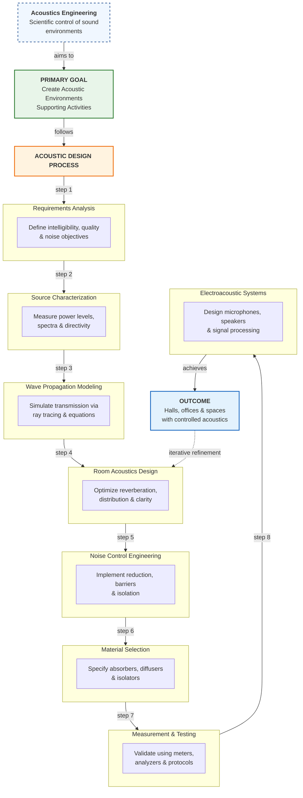

```mermaid
flowchart TD
    A[<b>Acoustics Engineering</b><br>Scientific control of sound<br>environments]:::title
    B[<b>PRIMARY GOAL</b><br>Create Acoustic Environments<br>Supporting Activities]:::goal
    C[<b>ACOUSTIC DESIGN PROCESS</b>]:::process
    
    subgraph D[Requirements Analysis]
        D1[Define intelligibility, quality<br>& noise objectives]
    end
    
    subgraph E[Source Characterization]
        E1[Measure power levels,<br>spectra & directivity]
    end
    
    subgraph F[Wave Propagation Modeling]
        F1[Simulate transmission via<br>ray tracing & equations]
    end
    
    subgraph G[Room Acoustics Design]
        G1[Optimize reverberation,<br>distribution & clarity]
    end
    
    subgraph H[Noise Control Engineering]
        H1[Implement reduction, barriers<br>& isolation]
    end
    
    subgraph I[Material Selection]
        I1[Specify absorbers, diffusers<br>& isolators]
    end
    
    subgraph J[Measurement & Testing]
        J1[Validate using meters,<br>analyzers & protocols]
    end
    
    subgraph K[Electroacoustic Systems]
        K1[Design microphones, speakers<br>& signal processing]
    end
    
    L[<b>OUTCOME</b><br>Halls, offices & spaces<br>with controlled acoustics]:::outcome
    
    A -->|aims to| B
    B -->|follows| C
    C -->|step 1| D
    D -->|step 2| E
    E -->|step 3| F
    F -->|step 4| G
    G -->|step 5| H
    H -->|step 6| I
    I -->|step 7| J
    J -->|step 8| K
    K -->|achieves| L
    L -.->|iterative refinement| G
    
    classDef title fill:#f0f7ff,stroke:#4a6fa5,stroke-width:2px,color:#333,stroke-dasharray:5 5
    classDef goal fill:#e8f5e9,stroke:#2e7d32,stroke-width:2px,color:#333
    classDef process fill:#fff3e0,stroke:#ef6c00,stroke-width:2px,color:#333
    classDef outcome fill:#e3f2fd,stroke:#1565c0,stroke-width:2px,color:#333
```
