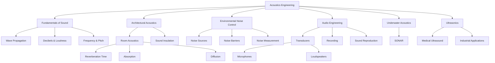

```mermaid
flowchart TD
    AE[Acoustics Engineering] --> Fundamentals[Fundamentals of Sound]
    AE --> Architectural[Architectural Acoustics]
    AE --> Environmental[Environmental Noise Control]
    AE --> Audio[Audio Engineering]
    AE --> Underwater[Underwater Acoustics]
    AE --> Ultrasonics[Ultrasonics]

    Fundamentals --> Wave[Wave Propagation]
    Fundamentals --> Decibels[Decibels & Loudness]
    Fundamentals --> Frequency[Frequency & Pitch]

    Architectural --> Room[Room Acoustics]
    Architectural --> Insulation[Sound Insulation]

    Room --> Reverberation[Reverberation Time]
    Room --> Absorption[Absorption]
    Room --> Diffusion[Diffusion]

    Environmental --> Sources[Noise Sources]
    Environmental --> Barriers[Noise Barriers]
    Environmental --> Measurement[Noise Measurement]

    Audio --> Transducers[Transducers]
    Audio --> Recording[Recording]
    Audio --> Reproduction[Sound Reproduction]

    Transducers --> Microphones[Microphones]
    Transducers --> Loudspeakers[Loudspeakers]

    Underwater --> Sonar[SONAR]

    Ultrasonics --> Medical[Medical Ultrasound]
    Ultrasonics --> Industrial[Industrial Applications]
```
