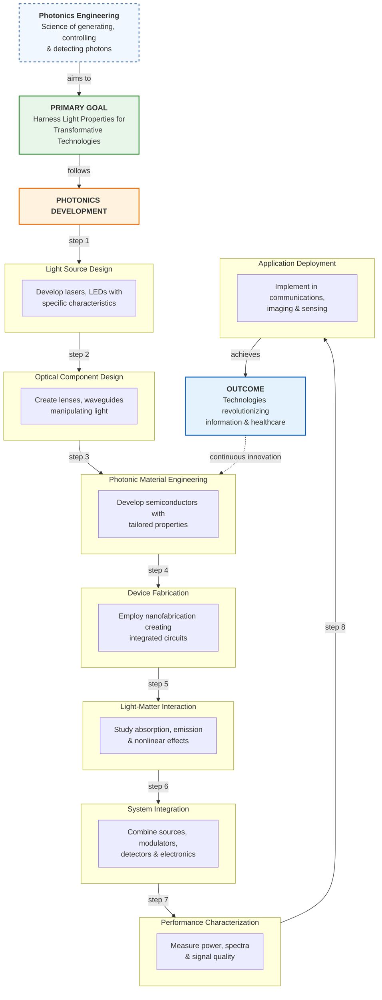

```mermaid
flowchart TD
    A[<b>Photonics Engineering</b><br>Science of generating, controlling<br>& detecting photons]:::title
    B[<b>PRIMARY GOAL</b><br>Harness Light Properties for<br>Transformative Technologies]:::goal
    C[<b>PHOTONICS DEVELOPMENT</b>]:::process
    
    subgraph D[Light Source Design]
        D1[Develop lasers, LEDs with<br>specific characteristics]
    end
    
    subgraph E[Optical Component Design]
        E1[Create lenses, waveguides<br>manipulating light]
    end
    
    subgraph F[Photonic Material Engineering]
        F1[Develop semiconductors with<br>tailored properties]
    end
    
    subgraph G[Device Fabrication]
        G1[Employ nanofabrication creating<br>integrated circuits]
    end
    
    subgraph H[Light-Matter Interaction]
        H1[Study absorption, emission<br>& nonlinear effects]
    end
    
    subgraph I[System Integration]
        I1[Combine sources, modulators,<br>detectors & electronics]
    end
    
    subgraph J[Performance Characterization]
        J1[Measure power, spectra<br>& signal quality]
    end
    
    subgraph K[Application Deployment]
        K1[Implement in communications,<br>imaging & sensing]
    end
    
    L[<b>OUTCOME</b><br>Technologies revolutionizing<br>information & healthcare]:::outcome
    
    A -->|aims to| B
    B -->|follows| C
    C -->|step 1| D
    D -->|step 2| E
    E -->|step 3| F
    F -->|step 4| G
    G -->|step 5| H
    H -->|step 6| I
    I -->|step 7| J
    J -->|step 8| K
    K -->|achieves| L
    L -.->|continuous innovation| F
    
    classDef title fill:#f0f7ff,stroke:#4a6fa5,stroke-width:2px,color:#333,stroke-dasharray:5 5
    classDef goal fill:#e8f5e9,stroke:#2e7d32,stroke-width:2px,color:#333
    classDef process fill:#fff3e0,stroke:#ef6c00,stroke-width:2px,color:#333
    classDef outcome fill:#e3f2fd,stroke:#1565c0,stroke-width:2px,color:#333
```
