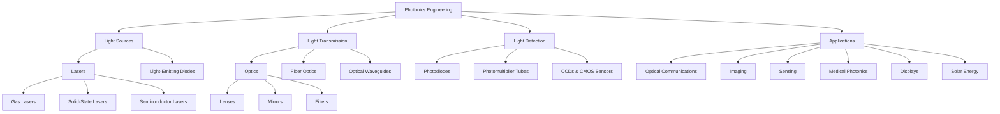

```mermaid
flowchart TD
    PE[Photonics Engineering] --> LightSources[Light Sources]
    PE --> Transmission[Light Transmission]
    PE --> Detection[Light Detection]
    PE --> Applications[Applications]

    LightSources --> Lasers[Lasers]
    LightSources --> LEDs[Light-Emitting Diodes]

    Lasers --> Gas[Gas Lasers]
    Lasers --> SolidState[Solid-State Lasers]
    Lasers --> Semiconductor[Semiconductor Lasers]

    Transmission --> Optics[Optics]
    Transmission --> Fiber[Fiber Optics]
    Transmission --> Waveguides[Optical Waveguides]

    Optics --> Lenses[Lenses]
    Optics --> Mirrors[Mirrors]
    Optics --> Filters[Filters]

    Detection --> Photodiodes[Photodiodes]
    Detection --> PMTs[Photomultiplier Tubes]
    Detection --> CCDs[CCDs & CMOS Sensors]

    Applications --> Communications[Optical Communications]
    Applications --> Imaging[Imaging]
    Applications --> Sensing[Sensing]
    Applications --> Medical[Medical Photonics]
    Applications --> Displays[Displays]
    Applications --> Energy[Solar Energy]
```
