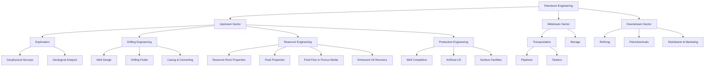

```mermaid
flowchart TD
    PE[Petroleum Engineering] --> Upstream[Upstream Sector]
    PE --> Midstream[Midstream Sector]
    PE --> Downstream[Downstream Sector]

    Upstream --> Exploration[Exploration]
    Upstream --> Drilling[Drilling Engineering]
    Upstream --> Reservoir[Reservoir Engineering]
    Upstream --> Production[Production Engineering]

    Exploration --> Geophysics[Geophysical Surveys]
    Exploration --> Geology[Geological Analysis]

    Drilling --> WellDesign[Well Design]
    Drilling --> DrillingFluids[Drilling Fluids]
    Drilling --> Casing[Casing & Cementing]

    Reservoir --> RockProperties[Reservoir Rock Properties]
    Reservoir --> FluidProperties[Fluid Properties]
    Reservoir --> Flow[Fluid Flow in Porous Media]
    Reservoir --> EOR[Enhanced Oil Recovery]

    Production --> WellCompletion[Well Completion]
    Production --> ArtificialLift[Artificial Lift]
    Production --> SurfaceFacilities[Surface Facilities]

    Midstream --> Transportation[Transportation]
    Midstream --> Storage[Storage]

    Transportation --> Pipelines[Pipelines]
    Transportation --> Tankers[Tankers]

    Downstream --> Refining[Refining]
    Downstream --> Petrochemicals[Petrochemicals]
    Downstream --> Distribution[Distribution & Marketing]
```
