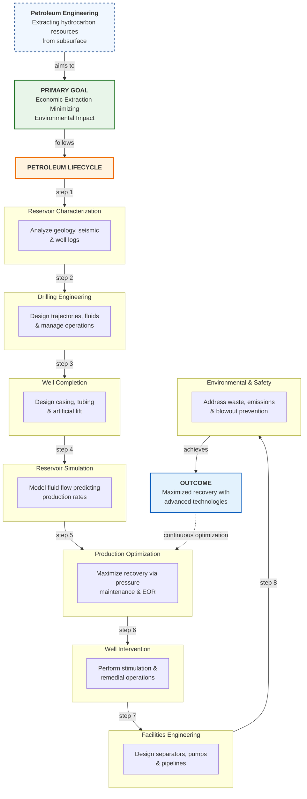

```mermaid
flowchart TD
    A[<b>Petroleum Engineering</b><br>Extracting hydrocarbon resources<br>from subsurface]:::title
    B[<b>PRIMARY GOAL</b><br>Economic Extraction Minimizing<br>Environmental Impact]:::goal
    C[<b>PETROLEUM LIFECYCLE</b>]:::process
    
    subgraph D[Reservoir Characterization]
        D1[Analyze geology, seismic<br>& well logs]
    end
    
    subgraph E[Drilling Engineering]
        E1[Design trajectories, fluids<br>& manage operations]
    end
    
    subgraph F[Well Completion]
        F1[Design casing, tubing<br>& artificial lift]
    end
    
    subgraph G[Reservoir Simulation]
        G1[Model fluid flow predicting<br>production rates]
    end
    
    subgraph H[Production Optimization]
        H1[Maximize recovery via pressure<br>maintenance & EOR]
    end
    
    subgraph I[Well Intervention]
        I1[Perform stimulation &<br>remedial operations]
    end
    
    subgraph J[Facilities Engineering]
        J1[Design separators, pumps<br>& pipelines]
    end
    
    subgraph K[Environmental & Safety]
        K1[Address waste, emissions<br>& blowout prevention]
    end
    
    L[<b>OUTCOME</b><br>Maximized recovery with<br>advanced technologies]:::outcome
    
    A -->|aims to| B
    B -->|follows| C
    C -->|step 1| D
    D -->|step 2| E
    E -->|step 3| F
    F -->|step 4| G
    G -->|step 5| H
    H -->|step 6| I
    I -->|step 7| J
    J -->|step 8| K
    K -->|achieves| L
    L -.->|continuous optimization| H
    
    classDef title fill:#f0f7ff,stroke:#4a6fa5,stroke-width:2px,color:#333,stroke-dasharray:5 5
    classDef goal fill:#e8f5e9,stroke:#2e7d32,stroke-width:2px,color:#333
    classDef process fill:#fff3e0,stroke:#ef6c00,stroke-width:2px,color:#333
    classDef outcome fill:#e3f2fd,stroke:#1565c0,stroke-width:2px,color:#333
```
