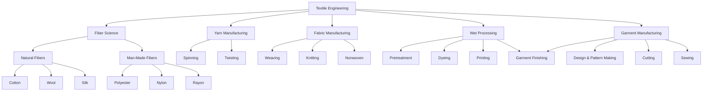

```mermaid
flowchart TD
    TE[Textile Engineering] --> Fibers[Fiber Science]
    TE --> Yarn[Yarn Manufacturing]
    TE --> Fabric[Fabric Manufacturing]
    TE --> WetProcessing[Wet Processing]
    TE --> Garment[Garment Manufacturing]

    Fibers --> Natural[Natural Fibers]
    Fibers --> ManMade[Man-Made Fibers]

    Natural --> Cotton[Cotton]
    Natural --> Wool[Wool]
    Natural --> Silk[Silk]

    ManMade --> Polyester[Polyester]
    ManMade --> Nylon[Nylon]
    ManMade --> Rayon[Rayon]

    Yarn --> Spinning[Spinning]
    Yarn --> Twisting[Twisting]

    Fabric --> Weaving[Weaving]
    Fabric --> Knitting[Knitting]
    Fabric --> Nonwoven[Nonwoven]

    WetProcessing --> Pretreatment[Pretreatment]
    WetProcessing --> Dyeing[Dyeing]
    WetProcessing --> Printing[Printing]
    WetProcessing --> Finishing[Finishing]

    Garment --> Design[Design & Pattern Making]
    Garment --> Cutting[Cutting]
    Garment --> Sewing[Sewing]
    Garment --> Finishing[Garment Finishing]
```
