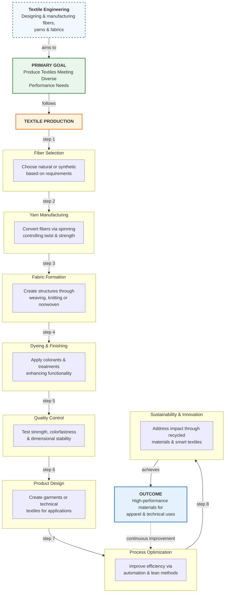

```mermaid
flowchart TD
    A[<b>Textile Engineering</b><br>Designing & manufacturing fibers,<br>yarns & fabrics]:::title
    B[<b>PRIMARY GOAL</b><br>Produce Textiles Meeting Diverse<br>Performance Needs]:::goal
    C[<b>TEXTILE PRODUCTION</b>]:::process
    
    subgraph D[Fiber Selection]
        D1[Choose natural or synthetic<br>based on requirements]
    end
    
    subgraph E[Yarn Manufacturing]
        E1[Convert fibers via spinning<br>controlling twist & strength]
    end
    
    subgraph F[Fabric Formation]
        F1[Create structures through<br>weaving, knitting or nonwoven]
    end
    
    subgraph G[Dyeing & Finishing]
        G1[Apply colorants & treatments<br>enhancing functionality]
    end
    
    subgraph H[Quality Control]
        H1[Test strength, colorfastness<br>& dimensional stability]
    end
    
    subgraph I[Product Design]
        I1[Create garments or technical<br>textiles for applications]
    end
    
    subgraph J[Process Optimization]
        J1[Improve efficiency via<br>automation & lean methods]
    end
    
    subgraph K[Sustainability & Innovation]
        K1[Address impact through recycled<br>materials & smart textiles]
    end
    
    L[<b>OUTCOME</b><br>High-performance materials for<br>apparel & technical uses]:::outcome
    
    A -->|aims to| B
    B -->|follows| C
    C -->|step 1| D
    D -->|step 2| E
    E -->|step 3| F
    F -->|step 4| G
    G -->|step 5| H
    H -->|step 6| I
    I -->|step 7| J
    J -->|step 8| K
    K -->|achieves| L
    L -.->|continuous improvement| J
    
    classDef title fill:#f0f7ff,stroke:#4a6fa5,stroke-width:2px,color:#333,stroke-dasharray:5 5
    classDef goal fill:#e8f5e9,stroke:#2e7d32,stroke-width:2px,color:#333
    classDef process fill:#fff3e0,stroke:#ef6c00,stroke-width:2px,color:#333
    classDef outcome fill:#e3f2fd,stroke:#1565c0,stroke-width:2px,color:#333
```
