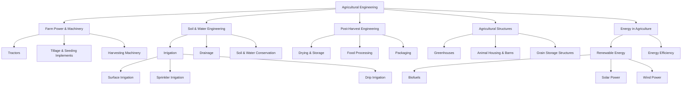

```mermaid
flowchart TD
    AgE[Agricultural Engineering] --> FarmPower[Farm Power & Machinery]
    AgE --> SoilWater[Soil & Water Engineering]
    AgE --> PostHarvest[Post-Harvest Engineering]
    AgE --> Structures[Agricultural Structures]
    AgE --> Energy[Energy in Agriculture]

    FarmPower --> Tractors[Tractors]
    FarmPower --> Implements[Tillage & Seeding Implements]
    FarmPower --> Harvesting[Harvesting Machinery]

    SoilWater --> Irrigation[Irrigation]
    SoilWater --> Drainage[Drainage]
    SoilWater --> Conservation[Soil & Water Conservation]

    Irrigation --> Surface[Surface Irrigation]
    Irrigation --> Sprinkler[Sprinkler Irrigation]
    Irrigation --> Drip[Drip Irrigation]

    PostHarvest --> Drying[Drying & Storage]
    PostHarvest --> Processing[Food Processing]
    PostHarvest --> Packaging[Packaging]

    Structures --> Greenhouses[Greenhouses]
    Structures --> Barns[Animal Housing & Barns]
    Structures --> Storage[Grain Storage Structures]

    Energy --> Renewable[Renewable Energy]
    Energy --> Efficiency[Energy Efficiency]

    Renewable --> Biofuels[Biofuels]
    Renewable --> Solar[Solar Power]
    Renewable --> Wind[Wind Power]
```
