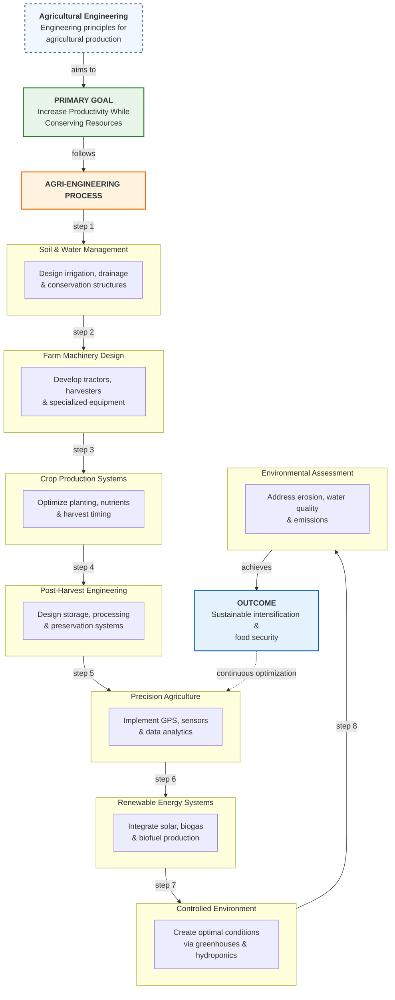

```mermaid
flowchart TD
    A[<b>Agricultural Engineering</b><br>Engineering principles for<br>agricultural production]:::title
    B[<b>PRIMARY GOAL</b><br>Increase Productivity While<br>Conserving Resources]:::goal
    C[<b>AGRI-ENGINEERING PROCESS</b>]:::process
    
    subgraph D[Soil & Water Management]
        D1[Design irrigation, drainage<br>& conservation structures]
    end
    
    subgraph E[Farm Machinery Design]
        E1[Develop tractors, harvesters<br>& specialized equipment]
    end
    
    subgraph F[Crop Production Systems]
        F1[Optimize planting, nutrients<br>& harvest timing]
    end
    
    subgraph G[Post-Harvest Engineering]
        G1[Design storage, processing<br>& preservation systems]
    end
    
    subgraph H[Precision Agriculture]
        H1[Implement GPS, sensors<br>& data analytics]
    end
    
    subgraph I[Renewable Energy Systems]
        I1[Integrate solar, biogas<br>& biofuel production]
    end
    
    subgraph J[Controlled Environment]
        J1[Create optimal conditions<br>via greenhouses & hydroponics]
    end
    
    subgraph K[Environmental Assessment]
        K1[Address erosion, water quality<br>& emissions]
    end
    
    L[<b>OUTCOME</b><br>Sustainable intensification &<br>food security]:::outcome
    
    A -->|aims to| B
    B -->|follows| C
    C -->|step 1| D
    D -->|step 2| E
    E -->|step 3| F
    F -->|step 4| G
    G -->|step 5| H
    H -->|step 6| I
    I -->|step 7| J
    J -->|step 8| K
    K -->|achieves| L
    L -.->|continuous optimization| H
    
    classDef title fill:#f0f7ff,stroke:#4a6fa5,stroke-width:2px,color:#333,stroke-dasharray:5 5
    classDef goal fill:#e8f5e9,stroke:#2e7d32,stroke-width:2px,color:#333
    classDef process fill:#fff3e0,stroke:#ef6c00,stroke-width:2px,color:#333
    classDef outcome fill:#e3f2fd,stroke:#1565c0,stroke-width:2px,color:#333
```
