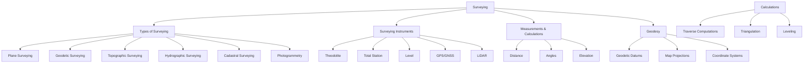

```mermaid
flowchart TD
    Surveying --> Types[Types of Surveying]
    Surveying --> Instruments[Surveying Instruments]
    Surveying --> Measurements[Measurements & Calculations]
    Surveying --> Geodesy[Geodesy]

    Types --> Plane[Plane Surveying]
    Types --> Geodetic[Geodetic Surveying]
    Types --> Topographic[Topographic Surveying]
    Types --> Hydrographic[Hydrographic Surveying]
    Types --> Cadastral[Cadastral Surveying]
    Types --> Photogrammetry[Photogrammetry]

    Instruments --> Theodolite[Theodolite]
    Instruments --> TotalStation[Total Station]
    Instruments --> Level[Level]
    Instruments --> GPS[GPS/GNSS]
    Instruments --> LiDAR[LiDAR]

    Measurements --> Distance[Distance]
    Measurements --> Angles[Angles]
    Measurements --> Elevation[Elevation]

    Calculations --> Traverse[Traverse Computations]
    Calculations --> Triangulation[Triangulation]
    Calculations --> Leveling[Leveling]

    Geodesy --> Datums[Geodetic Datums]
    Geodesy --> Projections[Map Projections]
    Geodesy --> CoordinateSystems[Coordinate Systems]
```
