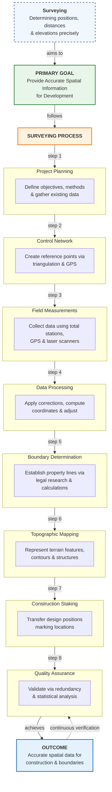

```mermaid
flowchart TD
    A[<b>Surveying</b><br>Determining positions, distances<br>& elevations precisely]:::title
    B[<b>PRIMARY GOAL</b><br>Provide Accurate Spatial Information<br>for Development]:::goal
    C[<b>SURVEYING PROCESS</b>]:::process
    
    subgraph D[Project Planning]
        D1[Define objectives, methods<br>& gather existing data]
    end
    
    subgraph E[Control Network]
        E1[Create reference points via<br>triangulation & GPS]
    end
    
    subgraph F[Field Measurements]
        F1[Collect data using total stations,<br>GPS & laser scanners]
    end
    
    subgraph G[Data Processing]
        G1[Apply corrections, compute<br>coordinates & adjust]
    end
    
    subgraph H[Boundary Determination]
        H1[Establish property lines via<br>legal research & calculations]
    end
    
    subgraph I[Topographic Mapping]
        I1[Represent terrain features,<br>contours & structures]
    end
    
    subgraph J[Construction Staking]
        J1[Transfer design positions<br>marking locations]
    end
    
    subgraph K[Quality Assurance]
        K1[Validate via redundancy<br>& statistical analysis]
    end
    
    L[<b>OUTCOME</b><br>Accurate spatial data for<br>construction & boundaries]:::outcome
    
    A -->|aims to| B
    B -->|follows| C
    C -->|step 1| D
    D -->|step 2| E
    E -->|step 3| F
    F -->|step 4| G
    G -->|step 5| H
    H -->|step 6| I
    I -->|step 7| J
    J -->|step 8| K
    K -->|achieves| L
    L -.->|continuous verification| K
    
    classDef title fill:#f0f7ff,stroke:#4a6fa5,stroke-width:2px,color:#333,stroke-dasharray:5 5
    classDef goal fill:#e8f5e9,stroke:#2e7d32,stroke-width:2px,color:#333
    classDef process fill:#fff3e0,stroke:#ef6c00,stroke-width:2px,color:#333
    classDef outcome fill:#e3f2fd,stroke:#1565c0,stroke-width:2px,color:#333
```
