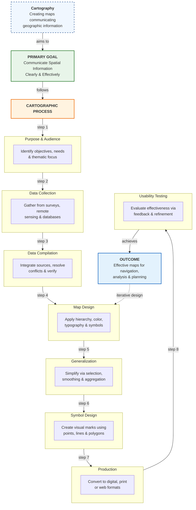

```mermaid
flowchart TD
    A[<b>Cartography</b><br>Creating maps communicating<br>geographic information]:::title
    B[<b>PRIMARY GOAL</b><br>Communicate Spatial Information<br>Clearly & Effectively]:::goal
    C[<b>CARTOGRAPHIC PROCESS</b>]:::process
    
    subgraph D[Purpose & Audience]
        D1[Identify objectives, needs<br>& thematic focus]
    end
    
    subgraph E[Data Collection]
        E1[Gather from surveys, remote<br>sensing & databases]
    end
    
    subgraph F[Data Compilation]
        F1[Integrate sources, resolve<br>conflicts & verify]
    end
    
    subgraph G[Map Design]
        G1[Apply hierarchy, color,<br>typography & symbols]
    end
    
    subgraph H[Generalization]
        H1[Simplify via selection,<br>smoothing & aggregation]
    end
    
    subgraph I[Symbol Design]
        I1[Create visual marks using<br>points, lines & polygons]
    end
    
    subgraph J[Production]
        J1[Convert to digital, print<br>or web formats]
    end
    
    subgraph K[Usability Testing]
        K1[Evaluate effectiveness via<br>feedback & refinement]
    end
    
    L[<b>OUTCOME</b><br>Effective maps for navigation,<br>analysis & planning]:::outcome
    
    A -->|aims to| B
    B -->|follows| C
    C -->|step 1| D
    D -->|step 2| E
    E -->|step 3| F
    F -->|step 4| G
    G -->|step 5| H
    H -->|step 6| I
    I -->|step 7| J
    J -->|step 8| K
    K -->|achieves| L
    L -.->|iterative design| G
    
    classDef title fill:#f0f7ff,stroke:#4a6fa5,stroke-width:2px,color:#333,stroke-dasharray:5 5
    classDef goal fill:#e8f5e9,stroke:#2e7d32,stroke-width:2px,color:#333
    classDef process fill:#fff3e0,stroke:#ef6c00,stroke-width:2px,color:#333
    classDef outcome fill:#e3f2fd,stroke:#1565c0,stroke-width:2px,color:#333
```