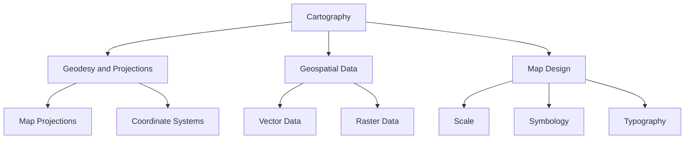

```mermaid
flowchart TD
    Cartography[Cartography] --> Geodesy[Geodesy and Projections]
    Cartography --> Data[Geospatial Data]
    Cartography --> MapDesign[Map Design]
    Geodesy --> Projections[Map Projections]
    Geodesy --> CoordinateSystems[Coordinate Systems]
    Data --> Vector[Vector Data]
    Data --> Raster[Raster Data]
    MapDesign --> Scale[Scale]
    MapDesign --> Symbology[Symbology]
    MapDesign --> Typography[Typography]
```