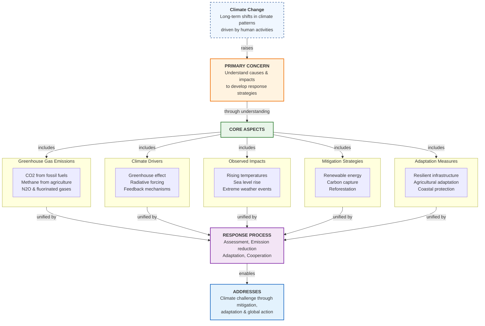

```mermaid
flowchart TD
    A[<b>Climate Change</b><br>Long-term shifts in climate patterns<br>driven by human activities]:::title
    B[<b>PRIMARY CONCERN</b><br>Understand causes & impacts<br>to develop response strategies]:::concern
    C[<b>CORE ASPECTS</b>]:::aspects
    
    subgraph D[Greenhouse Gas Emissions]
        D1[CO2 from fossil fuels<br>Methane from agriculture<br>N2O & fluorinated gases]
    end
    
    subgraph E[Climate Drivers]
        E1[Greenhouse effect<br>Radiative forcing<br>Feedback mechanisms]
    end
    
    subgraph F[Observed Impacts]
        F1[Rising temperatures<br>Sea level rise<br>Extreme weather events]
    end
    
    subgraph G[Mitigation Strategies]
        G1[Renewable energy<br>Carbon capture<br>Reforestation]
    end
    
    subgraph H[Adaptation Measures]
        H1[Resilient infrastructure<br>Agricultural adaptation<br>Coastal protection]
    end
    
    I[<b>RESPONSE PROCESS</b><br>Assessment, Emission reduction<br>Adaptation, Cooperation]:::process
    
    J[<b>ADDRESSES</b><br>Climate challenge through mitigation,<br>adaptation & global action]:::outcome
    
    A -->|raises| B
    B -->|through understanding| C
    C -->|includes| D
    C -->|includes| E
    C -->|includes| F
    C -->|includes| G
    C -->|includes| H
    D & E & F & G & H -->|unified by| I
    I -->|enables| J
    
    classDef title fill:#f0f7ff,stroke:#4a6fa5,stroke-width:2px,color:#333,stroke-dasharray: 5 5
    classDef concern fill:#fff3e0,stroke:#ef6c00,stroke-width:2px,color:#333
    classDef aspects fill:#e8f5e9,stroke:#2e7d32,stroke-width:2px,color:#333
    classDef process fill:#f3e5f5,stroke:#7b1fa2,stroke-width:2px,color:#333
    classDef outcome fill:#e3f2fd,stroke:#1565c0,stroke-width:2px,color:#333
```
