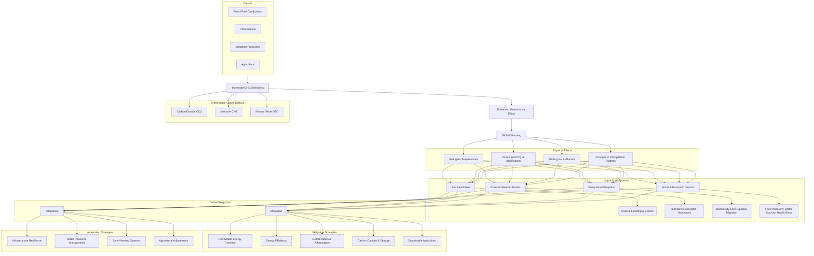

```mermaid
flowchart TD
    subgraph Causes
        A[Fossil Fuel Combustion]
        B[Deforestation]
        C[Industrial Processes]
        D[Agriculture]
    end

    subgraph "Greenhouse Gases (GHGs)"
        G1[Carbon Dioxide CO2]
        G2[Methane CH4]
        G3[Nitrous Oxide N2O]
    end

    Causes --> GHG[Increased GHG Emissions]
    GHG --> G1 & G2 & G3
    GHG --> EGE[Enhanced Greenhouse Effect]
    EGE --> GW[Global Warming]

    subgraph "Physical Effects"
        P1[Rising Air Temperatures]
        P2[Ocean Warming & Acidification]
        P3[Melting Ice & Glaciers]
        P4[Changes in Precipitation Patterns]
    end

    GW --> P1 & P2 & P3 & P4

    subgraph "Impacts on Systems"
        I1[Sea Level Rise] --> I1a(Coastal Flooding & Erosion)
        I2[Extreme Weather Events] --> I2a(Hurricanes, Droughts, Heatwaves)
        I3[Ecosystem Disruption] --> I3a(Biodiversity Loss, Species Migration)
        I4[Social & Economic Impacts] --> I4a(Food Insecurity, Water Scarcity, Health Risks)
    end

    P1 & P2 & P3 & P4 --> I1 & I2 & I3 & I4

    subgraph "Global Response"
        R1[Mitigation]
        R2[Adaptation]
    end

    I1 & I2 & I3 & I4 --> R1 & R2

    subgraph "Mitigation Strategies"
        M1[Renewable Energy Transition]
        M2[Energy Efficiency]
        M3[Reforestation & Afforestation]
        M4[Carbon Capture & Storage]
        M5[Sustainable Agriculture]
    end

    R1 --> M1 & M2 & M3 & M4 & M5

    subgraph "Adaptation Strategies"
        A1[Infrastructure Resilience]
        A2[Water Resource Management]
        A3[Early Warning Systems]
        A4[Agricultural Adjustments]
    end

    R2 --> A1 & A2 & A3 & A4
```
