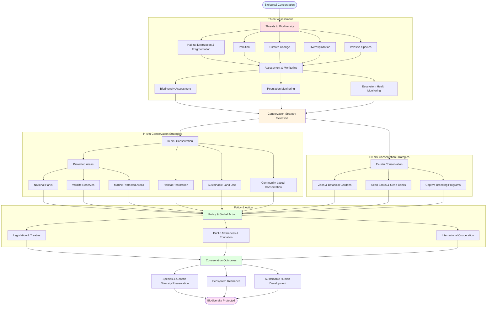

```mermaid
flowchart TD
    Start([Biological Conservation]) --> Threats[Threats to Biodiversity]
    
    Threats --> T1[Habitat Destruction & Fragmentation]
    Threats --> T2[Pollution]
    Threats --> T3[Climate Change]
    Threats --> T4[Overexploitation]
    Threats --> T5[Invasive Species]
    
    T1 --> Assessment[Assessment & Monitoring]
    T2 --> Assessment
    T3 --> Assessment
    T4 --> Assessment
    T5 --> Assessment
    
    Assessment --> A1[Biodiversity Assessment]
    Assessment --> A2[Population Monitoring]
    Assessment --> A3[Ecosystem Health Monitoring]
    
    A1 --> Strategy[Conservation Strategy Selection]
    A2 --> Strategy
    A3 --> Strategy
    
    Strategy --> C1[In-situ Conservation]
    Strategy --> C2[Ex-situ Conservation]
    
    C1 --> IS1[Protected Areas]
    C1 --> IS2[Habitat Restoration]
    C1 --> IS3[Sustainable Land Use]
    C1 --> IS4[Community-based Conservation]
    
    IS1 --> IS1a[National Parks]
    IS1 --> IS1b[Wildlife Reserves]
    IS1 --> IS1c[Marine Protected Areas]
    
    C2 --> ES1[Zoos & Botanical Gardens]
    C2 --> ES2[Seed Banks & Gene Banks]
    C2 --> ES3[Captive Breeding Programs]
    
    IS1a --> Policy[Policy & Global Action]
    IS1b --> Policy
    IS1c --> Policy
    IS2 --> Policy
    IS3 --> Policy
    IS4 --> Policy
    ES1 --> Policy
    ES2 --> Policy
    ES3 --> Policy
    
    Policy --> P1[Legislation & Treaties]
    Policy --> P2[Public Awareness & Education]
    Policy --> P3[International Cooperation]
    
    P1 --> Outcomes[Conservation Outcomes]
    P2 --> Outcomes
    P3 --> Outcomes
    
    Outcomes --> O1[Species & Genetic Diversity Preservation]
    Outcomes --> O2[Ecosystem Resilience]
    Outcomes --> O3[Sustainable Human Development]
    
    O1 --> End([Biodiversity Protected])
    O2 --> End
    O3 --> End
    
    subgraph Threat_Assessment["Threat Assessment"]
        Threats
        T1
        T2
        T3
        T4
        T5
        Assessment
        A1
        A2
        A3
    end
    
    subgraph In_Situ["In-situ Conservation Strategies"]
        C1
        IS1
        IS1a
        IS1b
        IS1c
        IS2
        IS3
        IS4
    end
    
    subgraph Ex_Situ["Ex-situ Conservation Strategies"]
        C2
        ES1
        ES2
        ES3
    end
    
    subgraph Policy_Action["Policy & Action"]
        Policy
        P1
        P2
        P3
    end
    
    style Start fill:#e1f5ff
    style End fill:#ffe1f5
    style Threats fill:#ffe1e1
    style Strategy fill:#fff4e1
    style Policy fill:#e1ffe1
    style Outcomes fill:#e1ffe1
```
