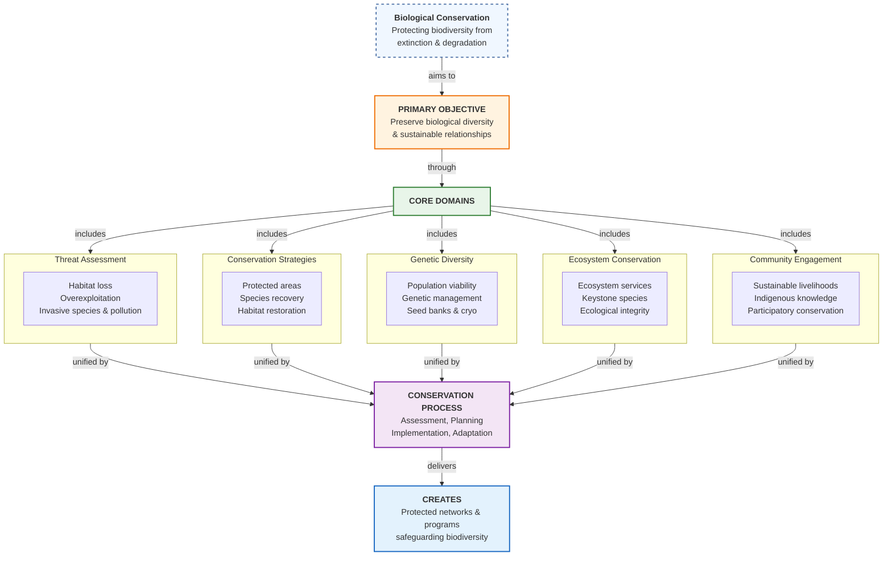

```mermaid
flowchart TD
    A[<b>Biological Conservation</b><br>Protecting biodiversity from<br>extinction & degradation]:::title
    B[<b>PRIMARY OBJECTIVE</b><br>Preserve biological diversity<br>& sustainable relationships]:::objective
    C[<b>CORE DOMAINS</b>]:::domains
    
    subgraph D[Threat Assessment]
        D1[Habitat loss<br>Overexploitation<br>Invasive species & pollution]
    end
    
    subgraph E[Conservation Strategies]
        E1[Protected areas<br>Species recovery<br>Habitat restoration]
    end
    
    subgraph F[Genetic Diversity]
        F1[Population viability<br>Genetic management<br>Seed banks & cryo]
    end
    
    subgraph G[Ecosystem Conservation]
        G1[Ecosystem services<br>Keystone species<br>Ecological integrity]
    end
    
    subgraph H[Community Engagement]
        H1[Sustainable livelihoods<br>Indigenous knowledge<br>Participatory conservation]
    end
    
    I[<b>CONSERVATION PROCESS</b><br>Assessment, Planning<br>Implementation, Adaptation]:::process
    
    J[<b>CREATES</b><br>Protected networks & programs<br>safeguarding biodiversity]:::outcome
    
    A -->|aims to| B
    B -->|through| C
    C -->|includes| D
    C -->|includes| E
    C -->|includes| F
    C -->|includes| G
    C -->|includes| H
    D & E & F & G & H -->|unified by| I
    I -->|delivers| J
    
    classDef title fill:#f0f7ff,stroke:#4a6fa5,stroke-width:2px,color:#333,stroke-dasharray: 5 5
    classDef objective fill:#fff3e0,stroke:#ef6c00,stroke-width:2px,color:#333
    classDef domains fill:#e8f5e9,stroke:#2e7d32,stroke-width:2px,color:#333
    classDef process fill:#f3e5f5,stroke:#7b1fa2,stroke-width:2px,color:#333
    classDef outcome fill:#e3f2fd,stroke:#1565c0,stroke-width:2px,color:#333
```
