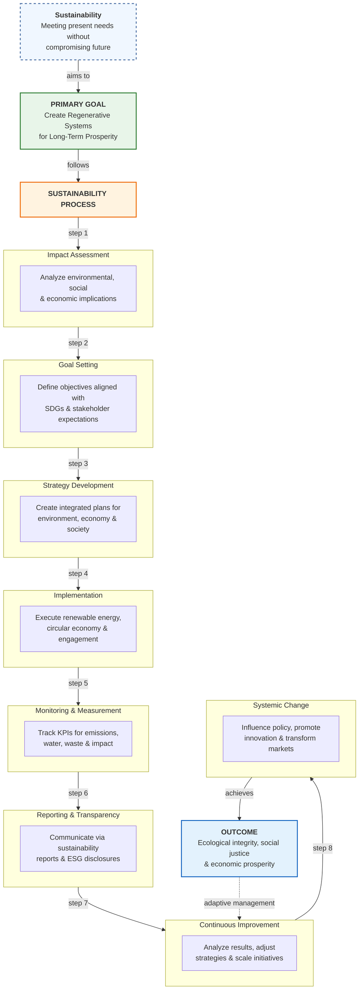

```mermaid
flowchart TD
    A[<b>Sustainability</b><br>Meeting present needs without<br>compromising future]:::title
    B[<b>PRIMARY GOAL</b><br>Create Regenerative Systems<br>for Long-Term Prosperity]:::goal
    C[<b>SUSTAINABILITY PROCESS</b>]:::process
    
    subgraph D[Impact Assessment]
        D1[Analyze environmental, social<br>& economic implications]
    end
    
    subgraph E[Goal Setting]
        E1[Define objectives aligned with<br>SDGs & stakeholder expectations]
    end
    
    subgraph F[Strategy Development]
        F1[Create integrated plans for<br>environment, economy & society]
    end
    
    subgraph G[Implementation]
        G1[Execute renewable energy,<br>circular economy & engagement]
    end
    
    subgraph H[Monitoring & Measurement]
        H1[Track KPIs for emissions,<br>water, waste & impact]
    end
    
    subgraph I[Reporting & Transparency]
        I1[Communicate via sustainability<br>reports & ESG disclosures]
    end
    
    subgraph J[Continuous Improvement]
        J1[Analyze results, adjust<br>strategies & scale initiatives]
    end
    
    subgraph K[Systemic Change]
        K1[Influence policy, promote<br>innovation & transform markets]
    end
    
    L[<b>OUTCOME</b><br>Ecological integrity, social justice<br>& economic prosperity]:::outcome
    
    A -->|aims to| B
    B -->|follows| C
    C -->|step 1| D
    D -->|step 2| E
    E -->|step 3| F
    F -->|step 4| G
    G -->|step 5| H
    H -->|step 6| I
    I -->|step 7| J
    J -->|step 8| K
    K -->|achieves| L
    L -.->|adaptive management| J
    
    classDef title fill:#f0f7ff,stroke:#4a6fa5,stroke-width:2px,color:#333,stroke-dasharray:5 5
    classDef goal fill:#e8f5e9,stroke:#2e7d32,stroke-width:2px,color:#333
    classDef process fill:#fff3e0,stroke:#ef6c00,stroke-width:2px,color:#333
    classDef outcome fill:#e3f2fd,stroke:#1565c0,stroke-width:2px,color:#333
```
