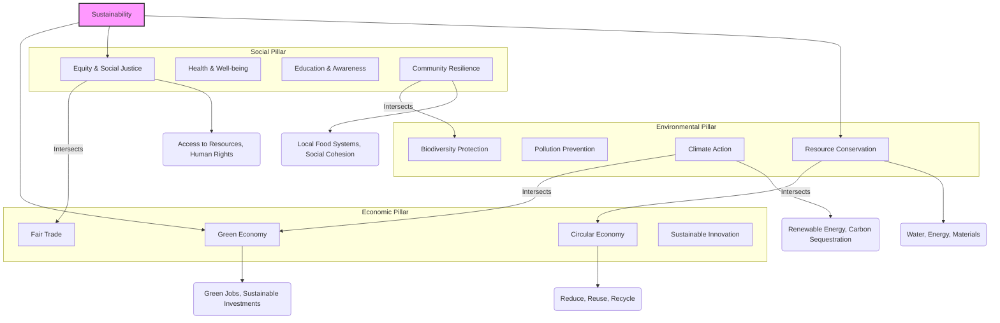

```mermaid
flowchart TD
    A[Sustainability]

    subgraph "Environmental Pillar"
        E1[Resource Conservation]
        E2[Pollution Prevention]
        E3[Climate Action]
        E4[Biodiversity Protection]
    end

    subgraph "Social Pillar"
        S1[Equity & Social Justice]
        S2[Health & Well-being]
        S3[Education & Awareness]
        S4[Community Resilience]
    end

    subgraph "Economic Pillar"
        C1[Green Economy]
        C2[Circular Economy]
        C3[Fair Trade]
        C4[Sustainable Innovation]
    end

    A --> E1 & S1 & C1

    E1 --> E1a(Water, Energy, Materials)
    E3 --> E3a(Renewable Energy, Carbon Sequestration)
    S1 --> S1a(Access to Resources, Human Rights)
    S4 --> S4a(Local Food Systems, Social Cohesion)
    C1 --> C1a(Green Jobs, Sustainable Investments)
    C2 --> C2a(Reduce, Reuse, Recycle)

    E1 -- Intersects --> C2
    E3 -- Intersects --> C1
    S1 -- Intersects --> C3
    S4 -- Intersects --> E4

    style A fill:#f9f,stroke:#333,stroke-width:2px
```
