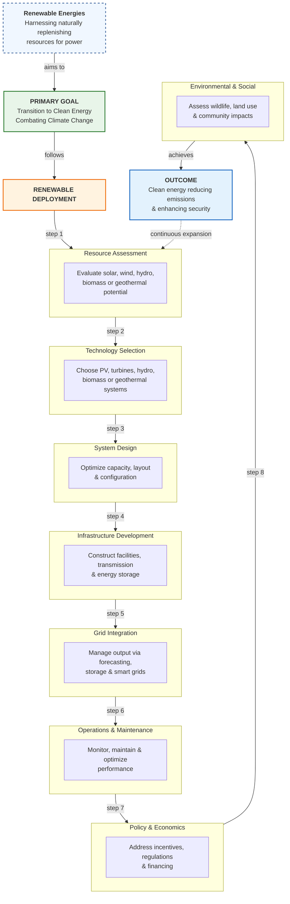

```mermaid
flowchart TD
    A[<b>Renewable Energies</b><br>Harnessing naturally replenishing<br>resources for power]:::title
    B[<b>PRIMARY GOAL</b><br>Transition to Clean Energy<br>Combating Climate Change]:::goal
    C[<b>RENEWABLE DEPLOYMENT</b>]:::process
    
    subgraph D[Resource Assessment]
        D1[Evaluate solar, wind, hydro,<br>biomass or geothermal potential]
    end
    
    subgraph E[Technology Selection]
        E1[Choose PV, turbines, hydro,<br>biomass or geothermal systems]
    end
    
    subgraph F[System Design]
        F1[Optimize capacity, layout<br>& configuration]
    end
    
    subgraph G[Infrastructure Development]
        G1[Construct facilities, transmission<br>& energy storage]
    end
    
    subgraph H[Grid Integration]
        H1[Manage output via forecasting,<br>storage & smart grids]
    end
    
    subgraph I[Operations & Maintenance]
        I1[Monitor, maintain & optimize<br>performance]
    end
    
    subgraph J[Policy & Economics]
        J1[Address incentives, regulations<br>& financing]
    end
    
    subgraph K[Environmental & Social]
        K1[Assess wildlife, land use<br>& community impacts]
    end
    
    L[<b>OUTCOME</b><br>Clean energy reducing emissions<br>& enhancing security]:::outcome
    
    A -->|aims to| B
    B -->|follows| C
    C -->|step 1| D
    D -->|step 2| E
    E -->|step 3| F
    F -->|step 4| G
    G -->|step 5| H
    H -->|step 6| I
    I -->|step 7| J
    J -->|step 8| K
    K -->|achieves| L
    L -.->|continuous expansion| D
    
    classDef title fill:#f0f7ff,stroke:#4a6fa5,stroke-width:2px,color:#333,stroke-dasharray:5 5
    classDef goal fill:#e8f5e9,stroke:#2e7d32,stroke-width:2px,color:#333
    classDef process fill:#fff3e0,stroke:#ef6c00,stroke-width:2px,color:#333
    classDef outcome fill:#e3f2fd,stroke:#1565c0,stroke-width:2px,color:#333
```