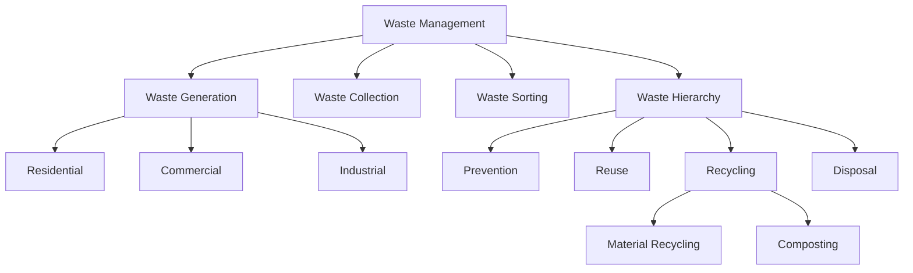

```mermaid
flowchart TD
    WasteManagement[Waste Management] --> Generation[Waste Generation]
    WasteManagement --> Collection[Waste Collection]
    WasteManagement --> Sorting[Waste Sorting]
    WasteManagement --> Hierarchy[Waste Hierarchy]
    Generation --> Residential[Residential]
    Generation --> Commercial[Commercial]
    Generation --> Industrial[Industrial]
    Hierarchy --> Prevention[Prevention]
    Hierarchy --> Reuse[Reuse]
    Hierarchy --> Recycling[Recycling]
    Hierarchy --> Disposal[Disposal]
    Recycling --> Material[Material Recycling]
    Recycling --> Composting[Composting]
```