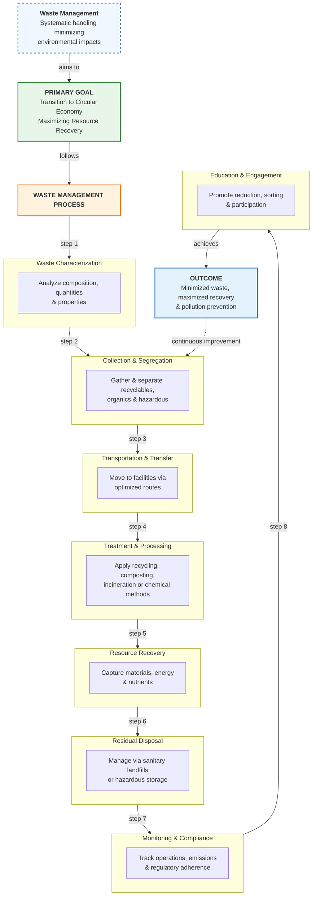

```mermaid
flowchart TD
    A[<b>Waste Management</b><br>Systematic handling minimizing<br>environmental impacts]:::title
    B[<b>PRIMARY GOAL</b><br>Transition to Circular Economy<br>Maximizing Resource Recovery]:::goal
    C[<b>WASTE MANAGEMENT PROCESS</b>]:::process
    
    subgraph D[Waste Characterization]
        D1[Analyze composition, quantities<br>& properties]
    end
    
    subgraph E[Collection & Segregation]
        E1[Gather & separate recyclables,<br>organics & hazardous]
    end
    
    subgraph F[Transportation & Transfer]
        F1[Move to facilities via<br>optimized routes]
    end
    
    subgraph G[Treatment & Processing]
        G1[Apply recycling, composting,<br>incineration or chemical methods]
    end
    
    subgraph H[Resource Recovery]
        H1[Capture materials, energy<br>& nutrients]
    end
    
    subgraph I[Residual Disposal]
        I1[Manage via sanitary landfills<br>or hazardous storage]
    end
    
    subgraph J[Monitoring & Compliance]
        J1[Track operations, emissions<br>& regulatory adherence]
    end
    
    subgraph K[Education & Engagement]
        K1[Promote reduction, sorting<br>& participation]
    end
    
    L[<b>OUTCOME</b><br>Minimized waste, maximized recovery<br>& pollution prevention]:::outcome
    
    A -->|aims to| B
    B -->|follows| C
    C -->|step 1| D
    D -->|step 2| E
    E -->|step 3| F
    F -->|step 4| G
    G -->|step 5| H
    H -->|step 6| I
    I -->|step 7| J
    J -->|step 8| K
    K -->|achieves| L
    L -.->|continuous improvement| E
    
    classDef title fill:#f0f7ff,stroke:#4a6fa5,stroke-width:2px,color:#333,stroke-dasharray:5 5
    classDef goal fill:#e8f5e9,stroke:#2e7d32,stroke-width:2px,color:#333
    classDef process fill:#fff3e0,stroke:#ef6c00,stroke-width:2px,color:#333
    classDef outcome fill:#e3f2fd,stroke:#1565c0,stroke-width:2px,color:#333
```