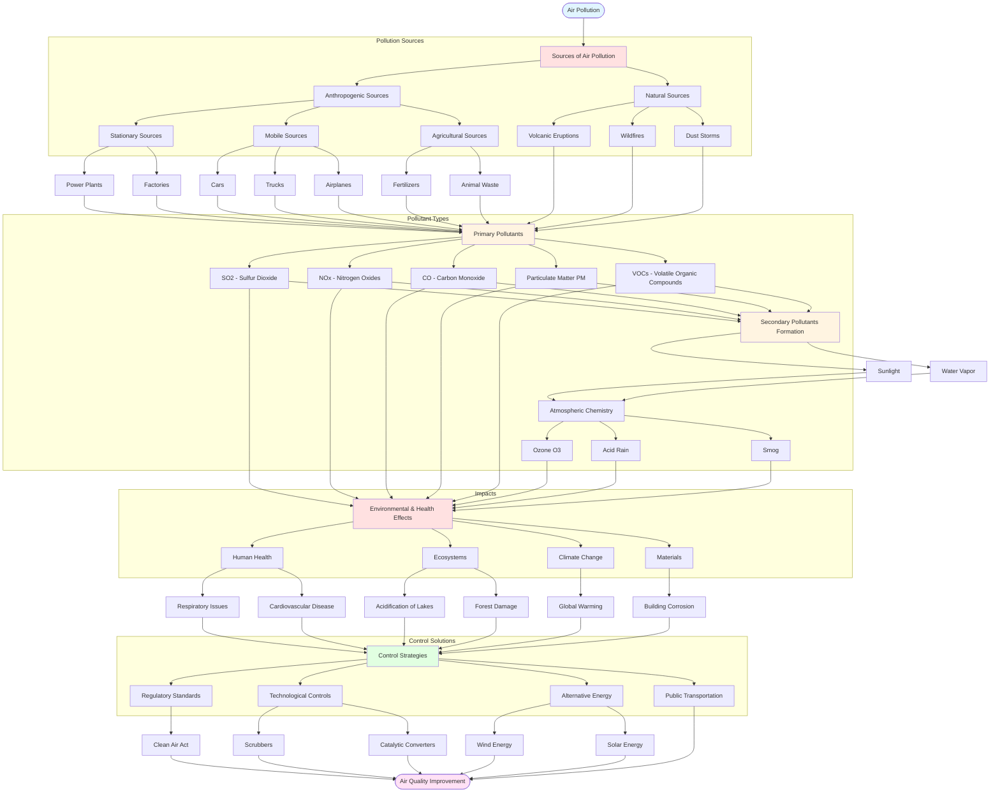

```mermaid
flowchart TD
    Start([Air Pollution]) --> Sources[Sources of Air Pollution]
    
    Sources --> Anthropogenic[Anthropogenic Sources]
    Sources --> Natural[Natural Sources]
    
    Anthropogenic --> A1[Stationary Sources]
    Anthropogenic --> A2[Mobile Sources]
    Anthropogenic --> A3[Agricultural Sources]
    
    A1 --> A1a[Power Plants]
    A1 --> A1b[Factories]
    A2 --> A2a[Cars]
    A2 --> A2b[Trucks]
    A2 --> A2c[Airplanes]
    A3 --> A3a[Fertilizers]
    A3 --> A3b[Animal Waste]
    
    Natural --> N1[Volcanic Eruptions]
    Natural --> N2[Wildfires]
    Natural --> N3[Dust Storms]
    
    A1a --> Primary[Primary Pollutants]
    A1b --> Primary
    A2a --> Primary
    A2b --> Primary
    A2c --> Primary
    A3a --> Primary
    A3b --> Primary
    N1 --> Primary
    N2 --> Primary
    N3 --> Primary
    
    Primary --> P1[SO2 - Sulfur Dioxide]
    Primary --> P2[NOx - Nitrogen Oxides]
    Primary --> P3[CO - Carbon Monoxide]
    Primary --> P4[Particulate Matter PM]
    Primary --> P5[VOCs - Volatile Organic Compounds]
    
    P1 --> Secondary[Secondary Pollutants Formation]
    P2 --> Secondary
    P3 --> Secondary
    P4 --> Secondary
    P5 --> Secondary
    
    Secondary --> AC1[Sunlight]
    Secondary --> AC2[Water Vapor]
    AC1 --> SP[Atmospheric Chemistry]
    AC2 --> SP
    
    SP --> S1[Ozone O3]
    SP --> S2[Acid Rain]
    SP --> S3[Smog]
    
    P1 --> Effects[Environmental & Health Effects]
    P2 --> Effects
    P3 --> Effects
    P4 --> Effects
    P5 --> Effects
    S1 --> Effects
    S2 --> Effects
    S3 --> Effects
    
    Effects --> E1[Human Health]
    Effects --> E2[Ecosystems]
    Effects --> E3[Climate Change]
    Effects --> E4[Materials]
    
    E1 --> E1a[Respiratory Issues]
    E1 --> E1b[Cardiovascular Disease]
    E2 --> E2a[Acidification of Lakes]
    E2 --> E2b[Forest Damage]
    E3 --> E3a[Global Warming]
    E4 --> E4a[Building Corrosion]
    
    E1a --> Control[Control Strategies]
    E1b --> Control
    E2a --> Control
    E2b --> Control
    E3a --> Control
    E4a --> Control
    
    Control --> C1[Regulatory Standards]
    Control --> C2[Technological Controls]
    Control --> C3[Alternative Energy]
    Control --> C4[Public Transportation]
    
    C1 --> C1a[Clean Air Act]
    C2 --> C2a[Scrubbers]
    C2 --> C2b[Catalytic Converters]
    C3 --> C3a[Wind Energy]
    C3 --> C3b[Solar Energy]
    
    C1a --> End([Air Quality Improvement])
    C2a --> End
    C2b --> End
    C3a --> End
    C3b --> End
    C4 --> End
    
    subgraph Sources_Group["Pollution Sources"]
        Sources
        Anthropogenic
        Natural
        A1
        A2
        A3
        N1
        N2
        N3
    end
    
    subgraph Pollutants["Pollutant Types"]
        Primary
        P1
        P2
        P3
        P4
        P5
        Secondary
        SP
        S1
        S2
        S3
    end
    
    subgraph Impacts["Impacts"]
        Effects
        E1
        E2
        E3
        E4
    end
    
    subgraph Solutions["Control Solutions"]
        Control
        C1
        C2
        C3
        C4
    end
    
    style Start fill:#e1f5ff
    style End fill:#ffe1f5
    style Sources fill:#ffe1e1
    style Primary fill:#fff4e1
    style Secondary fill:#fff4e1
    style Effects fill:#ffe1e1
    style Control fill:#e1ffe1
```
