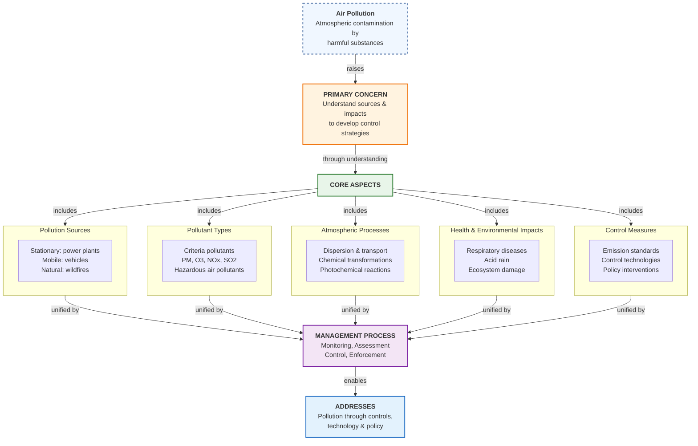

```mermaid
flowchart TD
    A[<b>Air Pollution</b><br>Atmospheric contamination by<br>harmful substances]:::title
    B[<b>PRIMARY CONCERN</b><br>Understand sources & impacts<br>to develop control strategies]:::concern
    C[<b>CORE ASPECTS</b>]:::aspects
    
    subgraph D[Pollution Sources]
        D1[Stationary: power plants<br>Mobile: vehicles<br>Natural: wildfires]
    end
    
    subgraph E[Pollutant Types]
        E1[Criteria pollutants<br>PM, O3, NOx, SO2<br>Hazardous air pollutants]
    end
    
    subgraph F[Atmospheric Processes]
        F1[Dispersion & transport<br>Chemical transformations<br>Photochemical reactions]
    end
    
    subgraph G[Health & Environmental Impacts]
        G1[Respiratory diseases<br>Acid rain<br>Ecosystem damage]
    end
    
    subgraph H[Control Measures]
        H1[Emission standards<br>Control technologies<br>Policy interventions]
    end
    
    I[<b>MANAGEMENT PROCESS</b><br>Monitoring, Assessment<br>Control, Enforcement]:::process
    
    J[<b>ADDRESSES</b><br>Pollution through controls,<br>technology & policy]:::outcome
    
    A -->|raises| B
    B -->|through understanding| C
    C -->|includes| D
    C -->|includes| E
    C -->|includes| F
    C -->|includes| G
    C -->|includes| H
    D & E & F & G & H -->|unified by| I
    I -->|enables| J
    
    classDef title fill:#f0f7ff,stroke:#4a6fa5,stroke-width:2px,color:#333,stroke-dasharray: 5 5
    classDef concern fill:#fff3e0,stroke:#ef6c00,stroke-width:2px,color:#333
    classDef aspects fill:#e8f5e9,stroke:#2e7d32,stroke-width:2px,color:#333
    classDef process fill:#f3e5f5,stroke:#7b1fa2,stroke-width:2px,color:#333
    classDef outcome fill:#e3f2fd,stroke:#1565c0,stroke-width:2px,color:#333
```
