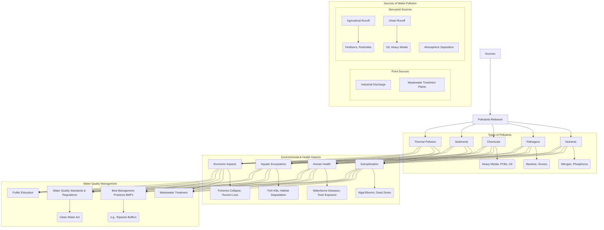

```mermaid
flowchart TD
    subgraph "Sources of Water Pollution"
        subgraph "Point Sources"
            PS1[Industrial Discharge]
            PS2[Wastewater Treatment Plants]
        end
        subgraph "Non-point Sources"
            NPS1[Agricultural Runoff] --> NPS1a(Fertilizers, Pesticides)
            NPS2[Urban Runoff] --> NPS2a(Oil, Heavy Metals)
            NPS3[Atmospheric Deposition]
        end
    end

    Sources --> P[Pollutants Released]

    subgraph "Types of Pollutants"
        T1[Nutrients] --> T1a(Nitrogen, Phosphorus)
        T2[Pathogens] --> T2a(Bacteria, Viruses)
        T3[Chemicals] --> T3a(Heavy Metals, PCBs, Oil)
        T4[Sediments]
        T5[Thermal Pollution]
    end

    P --> T1 & T2 & T3 & T4 & T5

    subgraph "Environmental & Health Impacts"
        E1[Eutrophication] --> E1a(Algal Blooms, Dead Zones)
        E2[Human Health] --> E2a(Waterborne Diseases, Toxin Exposure)
        E3[Aquatic Ecosystems] --> E3a(Fish Kills, Habitat Degradation)
        E4[Economic Impacts] --> E4a(Fisheries Collapse, Tourism Loss)
    end

    T1 & T2 & T3 & T4 & T5 --> E1 & E2 & E3 & E4

    subgraph "Water Quality Management"
        M1[Wastewater Treatment]
        M2[Best Management Practices BMPs] --> M2a(e.g., Riparian Buffers)
        M3[Water Quality Standards & Regulations] --> M3a(Clean Water Act)
        M4[Public Education]
    end

    E1 & E2 & E3 & E4 --> M1 & M2 & M3 & M4
```
