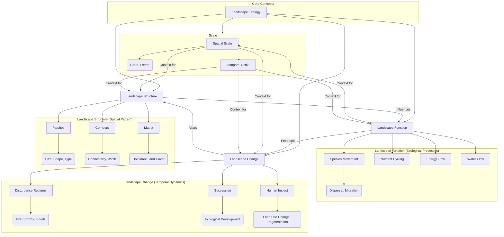

```mermaid
flowchart TD
    subgraph "Core Concepts"
        A[Landscape Ecology]
    end

    A --> LS[Landscape Structure]
    A --> LF[Landscape Function]
    A --> LC[Landscape Change]

    subgraph "Landscape Structure (Spatial Pattern)"
        P[Patches] --> Pa(Size, Shape, Type)
        C[Corridors] --> Ca(Connectivity, Width)
        M[Matrix] --> Ma(Dominant Land Cover)
    end

    LS --> P & C & M

    subgraph "Landscape Function (Ecological Processes)"
        F1[Species Movement] --> F1a(Dispersal, Migration)
        F2[Nutrient Cycling]
        F3[Energy Flow]
        F4[Water Flow]
    end

    LF --> F1 & F2 & F3 & F4

    LS -- Influences --> LF

    subgraph "Landscape Change (Temporal Dynamics)"
        D[Disturbance Regimes] --> D1(Fire, Storms, Floods)
        S[Succession] --> S1(Ecological Development)
        H[Human Impact] --> H1(Land Use Change, Fragmentation)
    end

    LC --> D & S & H

    LC -- Alters --> LS
    LF -- Feedback --> LC

    subgraph "Scale"
        SC1[Spatial Scale] --> SC1a(Grain, Extent)
        SC2[Temporal Scale]
    end

    A --> Scale
    Scale --> SC1 & SC2

    SC1 & SC2 -- Context for --> LS & LF & LC
```
