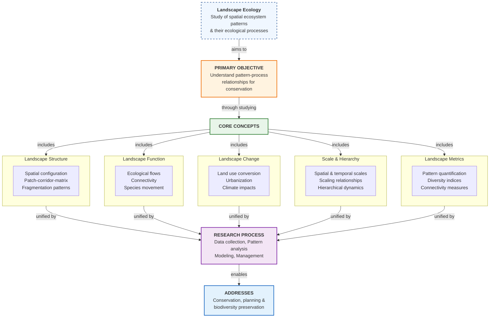

```mermaid
flowchart TD
    A[<b>Landscape Ecology</b><br>Study of spatial ecosystem patterns<br>& their ecological processes]:::title
    B[<b>PRIMARY OBJECTIVE</b><br>Understand pattern-process<br>relationships for conservation]:::objective
    C[<b>CORE CONCEPTS</b>]:::concepts
    
    subgraph D[Landscape Structure]
        D1[Spatial configuration<br>Patch-corridor-matrix<br>Fragmentation patterns]
    end
    
    subgraph E[Landscape Function]
        E1[Ecological flows<br>Connectivity<br>Species movement]
    end
    
    subgraph F[Landscape Change]
        F1[Land use conversion<br>Urbanization<br>Climate impacts]
    end
    
    subgraph G[Scale & Hierarchy]
        G1[Spatial & temporal scales<br>Scaling relationships<br>Hierarchical dynamics]
    end
    
    subgraph H[Landscape Metrics]
        H1[Pattern quantification<br>Diversity indices<br>Connectivity measures]
    end
    
    I[<b>RESEARCH PROCESS</b><br>Data collection, Pattern analysis<br>Modeling, Management]:::process
    
    J[<b>ADDRESSES</b><br>Conservation, planning &<br>biodiversity preservation]:::outcome
    
    A -->|aims to| B
    B -->|through studying| C
    C -->|includes| D
    C -->|includes| E
    C -->|includes| F
    C -->|includes| G
    C -->|includes| H
    D & E & F & G & H -->|unified by| I
    I -->|enables| J
    
    classDef title fill:#f0f7ff,stroke:#4a6fa5,stroke-width:2px,color:#333,stroke-dasharray: 5 5
    classDef objective fill:#fff3e0,stroke:#ef6c00,stroke-width:2px,color:#333
    classDef concepts fill:#e8f5e9,stroke:#2e7d32,stroke-width:2px,color:#333
    classDef process fill:#f3e5f5,stroke:#7b1fa2,stroke-width:2px,color:#333
    classDef outcome fill:#e3f2fd,stroke:#1565c0,stroke-width:2px,color:#333
```
