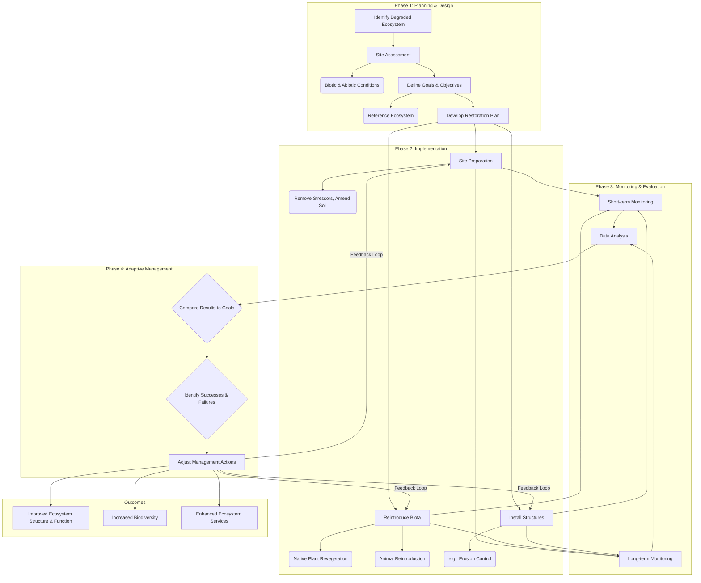

```mermaid
flowchart TD
    subgraph "Phase 1: Planning & Design"
        P1[Identify Degraded Ecosystem]
        P2[Site Assessment] --> P2a(Biotic & Abiotic Conditions)
        P3[Define Goals & Objectives] --> P3a(Reference Ecosystem)
        P4[Develop Restoration Plan]
    end

    P1 --> P2 --> P3 --> P4

    subgraph "Phase 2: Implementation"
        I1[Site Preparation] --> I1a(Remove Stressors, Amend Soil)
        I2[Reintroduce Biota] --> I2a(Native Plant Revegetation)
        I2 --> I2b(Animal Reintroduction)
        I3[Install Structures] --> I3a(e.g., Erosion Control)
    end

    P4 --> I1 & I2 & I3

    subgraph "Phase 3: Monitoring & Evaluation"
        M1[Short-term Monitoring]
        M2[Long-term Monitoring]
        M3[Data Analysis]
    end

    I1 & I2 & I3 --> M1 & M2
    M1 & M2 --> M3

    subgraph "Phase 4: Adaptive Management"
        AM1{Compare Results to Goals}
        AM2{Identify Successes & Failures}
        AM3[Adjust Management Actions]
    end

    M3 --> AM1 --> AM2 --> AM3
    AM3 -- Feedback Loop --> I1 & I2 & I3

    subgraph "Outcomes"
        O1[Improved Ecosystem Structure & Function]
        O2[Increased Biodiversity]
        O3[Enhanced Ecosystem Services]
    end

    AM3 --> O1 & O2 & O3
```
