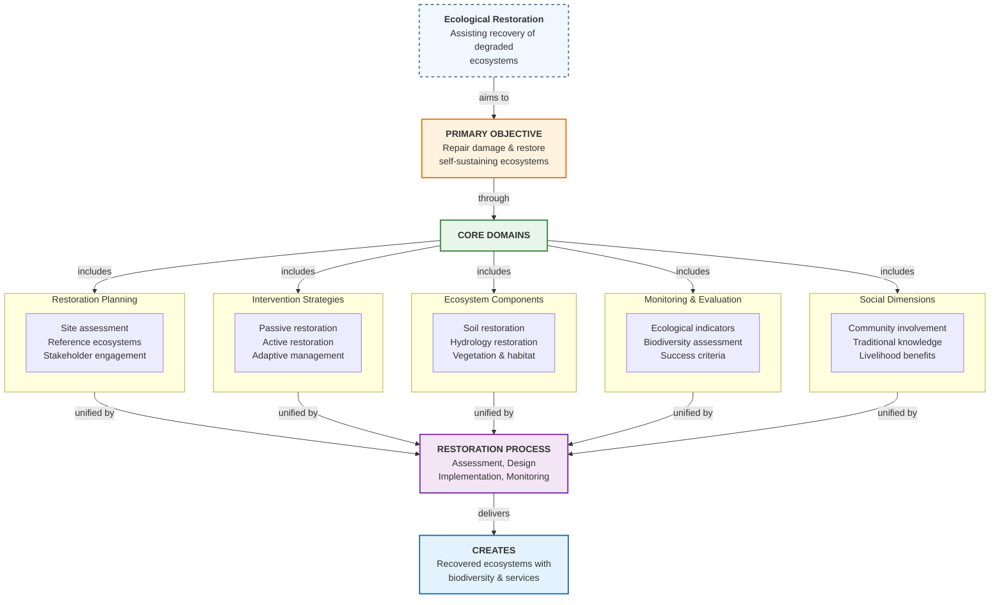

```mermaid
flowchart TD
    A[<b>Ecological Restoration</b><br>Assisting recovery of degraded<br>ecosystems]:::title
    B[<b>PRIMARY OBJECTIVE</b><br>Repair damage & restore<br>self-sustaining ecosystems]:::objective
    C[<b>CORE DOMAINS</b>]:::domains
    
    subgraph D[Restoration Planning]
        D1[Site assessment<br>Reference ecosystems<br>Stakeholder engagement]
    end
    
    subgraph E[Intervention Strategies]
        E1[Passive restoration<br>Active restoration<br>Adaptive management]
    end
    
    subgraph F[Ecosystem Components]
        F1[Soil restoration<br>Hydrology restoration<br>Vegetation & habitat]
    end
    
    subgraph G[Monitoring & Evaluation]
        G1[Ecological indicators<br>Biodiversity assessment<br>Success criteria]
    end
    
    subgraph H[Social Dimensions]
        H1[Community involvement<br>Traditional knowledge<br>Livelihood benefits]
    end
    
    I[<b>RESTORATION PROCESS</b><br>Assessment, Design<br>Implementation, Monitoring]:::process
    
    J[<b>CREATES</b><br>Recovered ecosystems with<br>biodiversity & services]:::outcome
    
    A -->|aims to| B
    B -->|through| C
    C -->|includes| D
    C -->|includes| E
    C -->|includes| F
    C -->|includes| G
    C -->|includes| H
    D & E & F & G & H -->|unified by| I
    I -->|delivers| J
    
    classDef title fill:#f0f7ff,stroke:#4a6fa5,stroke-width:2px,color:#333,stroke-dasharray: 5 5
    classDef objective fill:#fff3e0,stroke:#ef6c00,stroke-width:2px,color:#333
    classDef domains fill:#e8f5e9,stroke:#2e7d32,stroke-width:2px,color:#333
    classDef process fill:#f3e5f5,stroke:#7b1fa2,stroke-width:2px,color:#333
    classDef outcome fill:#e3f2fd,stroke:#1565c0,stroke-width:2px,color:#333
```
