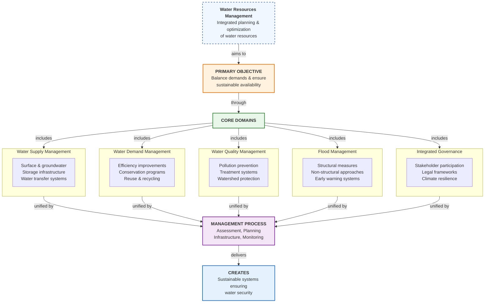

```mermaid
flowchart TD
    A[<b>Water Resources Management</b><br>Integrated planning & optimization<br>of water resources]:::title
    B[<b>PRIMARY OBJECTIVE</b><br>Balance demands & ensure<br>sustainable availability]:::objective
    C[<b>CORE DOMAINS</b>]:::domains
    
    subgraph D[Water Supply Management]
        D1[Surface & groundwater<br>Storage infrastructure<br>Water transfer systems]
    end
    
    subgraph E[Water Demand Management]
        E1[Efficiency improvements<br>Conservation programs<br>Reuse & recycling]
    end
    
    subgraph F[Water Quality Management]
        F1[Pollution prevention<br>Treatment systems<br>Watershed protection]
    end
    
    subgraph G[Flood Management]
        G1[Structural measures<br>Non-structural approaches<br>Early warning systems]
    end
    
    subgraph H[Integrated Governance]
        H1[Stakeholder participation<br>Legal frameworks<br>Climate resilience]
    end
    
    I[<b>MANAGEMENT PROCESS</b><br>Assessment, Planning<br>Infrastructure, Monitoring]:::process
    
    J[<b>CREATES</b><br>Sustainable systems ensuring<br>water security]:::outcome
    
    A -->|aims to| B
    B -->|through| C
    C -->|includes| D
    C -->|includes| E
    C -->|includes| F
    C -->|includes| G
    C -->|includes| H
    D & E & F & G & H -->|unified by| I
    I -->|delivers| J
    
    classDef title fill:#f0f7ff,stroke:#4a6fa5,stroke-width:2px,color:#333,stroke-dasharray: 5 5
    classDef objective fill:#fff3e0,stroke:#ef6c00,stroke-width:2px,color:#333
    classDef domains fill:#e8f5e9,stroke:#2e7d32,stroke-width:2px,color:#333
    classDef process fill:#f3e5f5,stroke:#7b1fa2,stroke-width:2px,color:#333
    classDef outcome fill:#e3f2fd,stroke:#1565c0,stroke-width:2px,color:#333
```