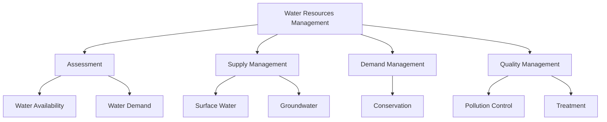

```mermaid
flowchart TD
    WaterResourcesManagement[Water Resources Management] --> Assessment[Assessment]
    WaterResourcesManagement --> Supply[Supply Management]
    WaterResourcesManagement --> Demand[Demand Management]
    WaterResourcesManagement --> Quality[Quality Management]
    Assessment --> Availability[Water Availability]
    Assessment --> WaterDemand[Water Demand]
    Supply --> Surface[Surface Water]
    Supply --> Groundwater[Groundwater]
    Demand --> Conservation[Conservation]
    Quality --> Pollution[Pollution Control]
    Quality --> Treatment[Treatment]
```