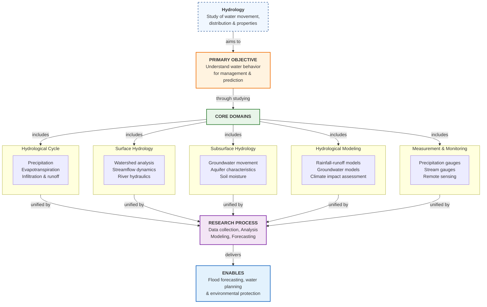

```mermaid
flowchart TD
    A[<b>Hydrology</b><br>Study of water movement,<br>distribution & properties]:::title
    B[<b>PRIMARY OBJECTIVE</b><br>Understand water behavior<br>for management & prediction]:::objective
    C[<b>CORE DOMAINS</b>]:::domains
    
    subgraph D[Hydrological Cycle]
        D1[Precipitation<br>Evapotranspiration<br>Infiltration & runoff]
    end
    
    subgraph E[Surface Hydrology]
        E1[Watershed analysis<br>Streamflow dynamics<br>River hydraulics]
    end
    
    subgraph F[Subsurface Hydrology]
        F1[Groundwater movement<br>Aquifer characteristics<br>Soil moisture]
    end
    
    subgraph G[Hydrological Modeling]
        G1[Rainfall-runoff models<br>Groundwater models<br>Climate impact assessment]
    end
    
    subgraph H[Measurement & Monitoring]
        H1[Precipitation gauges<br>Stream gauges<br>Remote sensing]
    end
    
    I[<b>RESEARCH PROCESS</b><br>Data collection, Analysis<br>Modeling, Forecasting]:::process
    
    J[<b>ENABLES</b><br>Flood forecasting, water planning<br>& environmental protection]:::outcome
    
    A -->|aims to| B
    B -->|through studying| C
    C -->|includes| D
    C -->|includes| E
    C -->|includes| F
    C -->|includes| G
    C -->|includes| H
    D & E & F & G & H -->|unified by| I
    I -->|delivers| J
    
    classDef title fill:#f0f7ff,stroke:#4a6fa5,stroke-width:2px,color:#333,stroke-dasharray: 5 5
    classDef objective fill:#fff3e0,stroke:#ef6c00,stroke-width:2px,color:#333
    classDef domains fill:#e8f5e9,stroke:#2e7d32,stroke-width:2px,color:#333
    classDef process fill:#f3e5f5,stroke:#7b1fa2,stroke-width:2px,color:#333
    classDef outcome fill:#e3f2fd,stroke:#1565c0,stroke-width:2px,color:#333
```
