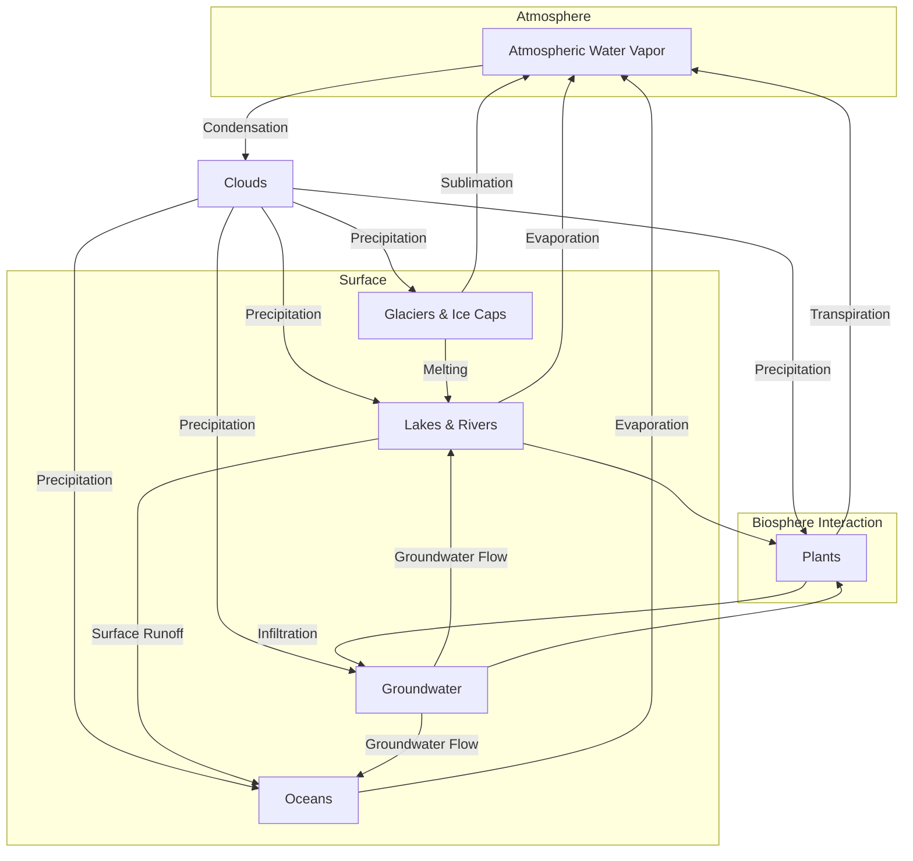

```mermaid
flowchart TD
    subgraph "Atmosphere"
        A[Atmospheric Water Vapor]
    end

    subgraph "Surface"
        O[Oceans]
        L[Lakes & Rivers]
        G[Glaciers & Ice Caps]
        GW[Groundwater]
    end

    O -- Evaporation --> A
    L -- Evaporation --> A
    G -- Sublimation --> A

    A -- Condensation --> C[Clouds]
    C -- Precipitation --> O & L & G & GW

    L -- Surface Runoff --> O
    GW -- Groundwater Flow --> O & L

    G -- Melting --> L

    subgraph "Biosphere Interaction"
        P[Plants] -- Transpiration --> A
        P -- Infiltration --> GW
    end

    C -- Precipitation --> P
    L & GW --> P
```
