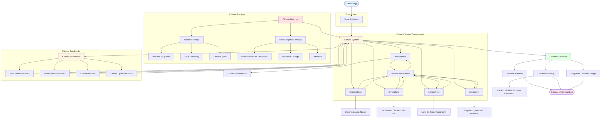

```mermaid
flowchart TD
    Start([Climatology]) --> S[Solar Radiation]
    S --> CS[Climate System]
    
    CS --> A[Atmosphere]
    CS --> H[Hydrosphere]
    CS --> C[Cryosphere]
    CS --> L[Lithosphere]
    CS --> B[Biosphere]
    
    A --> A1[Gases and Aerosols]
    H --> H1[Oceans, Lakes, Rivers]
    C --> C1[Ice Sheets, Glaciers, Sea Ice]
    L --> L1[Land Surface, Topography]
    B --> B1[Vegetation, Animals, Humans]
    
    A --> Interactions[System Interactions]
    H --> Interactions
    C --> Interactions
    L --> Interactions
    B --> Interactions
    
    Interactions --> A
    Interactions --> H
    Interactions --> C
    Interactions --> L
    Interactions --> B
    
    Forcings[Climate Forcings] --> CS
    
    Forcings --> Natural[Natural Forcings]
    Forcings --> Anthropogenic[Anthropogenic Forcings]
    
    Natural --> NF1[Volcanic Eruptions]
    Natural --> NF2[Solar Variability]
    Natural --> NF3[Orbital Cycles]
    
    Anthropogenic --> AF1[Greenhouse Gas Emissions]
    Anthropogenic --> AF2[Land Use Change]
    Anthropogenic --> AF3[Aerosols]
    
    CS --> Feedbacks[Climate Feedbacks]
    
    Feedbacks --> FB1[Ice-Albedo Feedback]
    Feedbacks --> FB2[Water Vapor Feedback]
    Feedbacks --> FB3[Cloud Feedback]
    Feedbacks --> FB4[Carbon Cycle Feedback]
    
    FB1 --> CS
    FB2 --> CS
    FB3 --> CS
    FB4 --> CS
    
    CS --> Outcomes[Climate Outcomes]
    
    Outcomes --> O1[Weather Patterns]
    Outcomes --> O2[Climate Variability]
    Outcomes --> O3[Long-term Climate Change]
    
    O2 --> O2a[ENSO - El Niño Southern Oscillation]
    
    O1 --> End([Climate Understanding])
    O2 --> End
    O3 --> End
    
    subgraph Energy_Input["Energy Input"]
        S
    end
    
    subgraph System_Components["Climate System Components"]
        CS
        A
        H
        C
        L
        B
        Interactions
    end
    
    subgraph Climate_Forcings["Climate Forcings"]
        Forcings
        Natural
        Anthropogenic
        NF1
        NF2
        NF3
        AF1
        AF2
        AF3
    end
    
    subgraph Feedbacks_Group["Climate Feedbacks"]
        Feedbacks
        FB1
        FB2
        FB3
        FB4
    end
    
    style Start fill:#e1f5ff
    style End fill:#ffe1f5
    style CS fill:#fff4e1
    style Forcings fill:#ffe1e1
    style Feedbacks fill:#fff4e1
    style Outcomes fill:#e1ffe1
```
