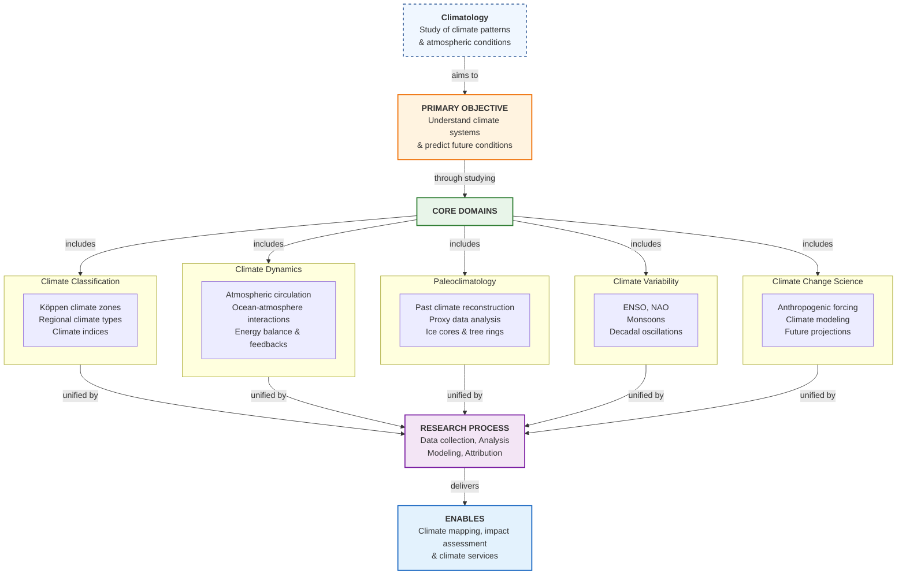

```mermaid
flowchart TD
    A[<b>Climatology</b><br>Study of climate patterns<br>& atmospheric conditions]:::title
    B[<b>PRIMARY OBJECTIVE</b><br>Understand climate systems<br>& predict future conditions]:::objective
    C[<b>CORE DOMAINS</b>]:::domains
    
    subgraph D[Climate Classification]
        D1[Köppen climate zones<br>Regional climate types<br>Climate indices]
    end
    
    subgraph E[Climate Dynamics]
        E1[Atmospheric circulation<br>Ocean-atmosphere interactions<br>Energy balance & feedbacks]
    end
    
    subgraph F[Paleoclimatology]
        F1[Past climate reconstruction<br>Proxy data analysis<br>Ice cores & tree rings]
    end
    
    subgraph G[Climate Variability]
        G1[ENSO, NAO<br>Monsoons<br>Decadal oscillations]
    end
    
    subgraph H[Climate Change Science]
        H1[Anthropogenic forcing<br>Climate modeling<br>Future projections]
    end
    
    I[<b>RESEARCH PROCESS</b><br>Data collection, Analysis<br>Modeling, Attribution]:::process
    
    J[<b>ENABLES</b><br>Climate mapping, impact assessment<br>& climate services]:::outcome
    
    A -->|aims to| B
    B -->|through studying| C
    C -->|includes| D
    C -->|includes| E
    C -->|includes| F
    C -->|includes| G
    C -->|includes| H
    D & E & F & G & H -->|unified by| I
    I -->|delivers| J
    
    classDef title fill:#f0f7ff,stroke:#4a6fa5,stroke-width:2px,color:#333,stroke-dasharray: 5 5
    classDef objective fill:#fff3e0,stroke:#ef6c00,stroke-width:2px,color:#333
    classDef domains fill:#e8f5e9,stroke:#2e7d32,stroke-width:2px,color:#333
    classDef process fill:#f3e5f5,stroke:#7b1fa2,stroke-width:2px,color:#333
    classDef outcome fill:#e3f2fd,stroke:#1565c0,stroke-width:2px,color:#333
```
