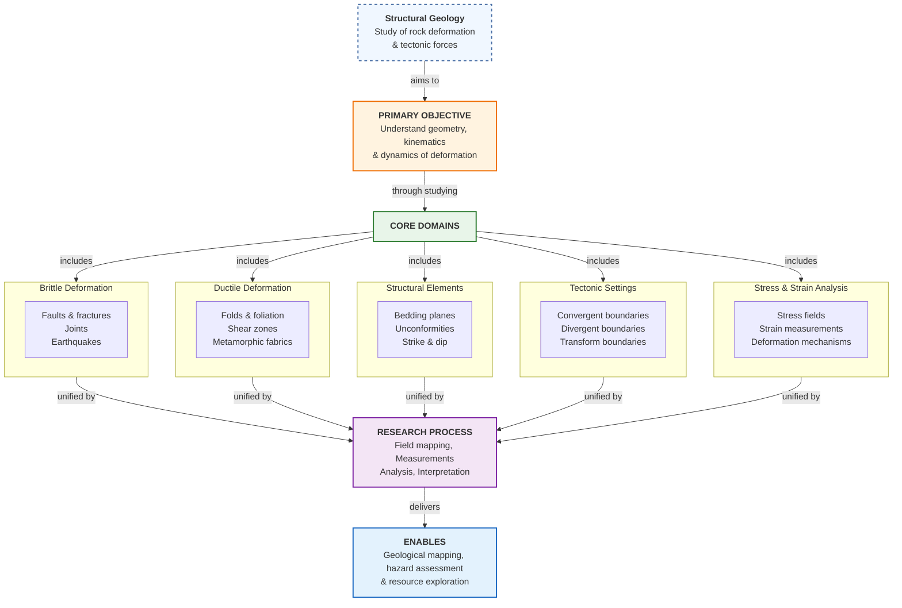

```mermaid
flowchart TD
    A[<b>Structural Geology</b><br>Study of rock deformation<br>& tectonic forces]:::title
    B[<b>PRIMARY OBJECTIVE</b><br>Understand geometry, kinematics<br>& dynamics of deformation]:::objective
    C[<b>CORE DOMAINS</b>]:::domains
    
    subgraph D[Brittle Deformation]
        D1[Faults & fractures<br>Joints<br>Earthquakes]
    end
    
    subgraph E[Ductile Deformation]
        E1[Folds & foliation<br>Shear zones<br>Metamorphic fabrics]
    end
    
    subgraph F[Structural Elements]
        F1[Bedding planes<br>Unconformities<br>Strike & dip]
    end
    
    subgraph G[Tectonic Settings]
        G1[Convergent boundaries<br>Divergent boundaries<br>Transform boundaries]
    end
    
    subgraph H[Stress & Strain Analysis]
        H1[Stress fields<br>Strain measurements<br>Deformation mechanisms]
    end
    
    I[<b>RESEARCH PROCESS</b><br>Field mapping, Measurements<br>Analysis, Interpretation]:::process
    
    J[<b>ENABLES</b><br>Geological mapping, hazard assessment<br>& resource exploration]:::outcome
    
    A -->|aims to| B
    B -->|through studying| C
    C -->|includes| D
    C -->|includes| E
    C -->|includes| F
    C -->|includes| G
    C -->|includes| H
    D & E & F & G & H -->|unified by| I
    I -->|delivers| J
    
    classDef title fill:#f0f7ff,stroke:#4a6fa5,stroke-width:2px,color:#333,stroke-dasharray: 5 5
    classDef objective fill:#fff3e0,stroke:#ef6c00,stroke-width:2px,color:#333
    classDef domains fill:#e8f5e9,stroke:#2e7d32,stroke-width:2px,color:#333
    classDef process fill:#f3e5f5,stroke:#7b1fa2,stroke-width:2px,color:#333
    classDef outcome fill:#e3f2fd,stroke:#1565c0,stroke-width:2px,color:#333
```