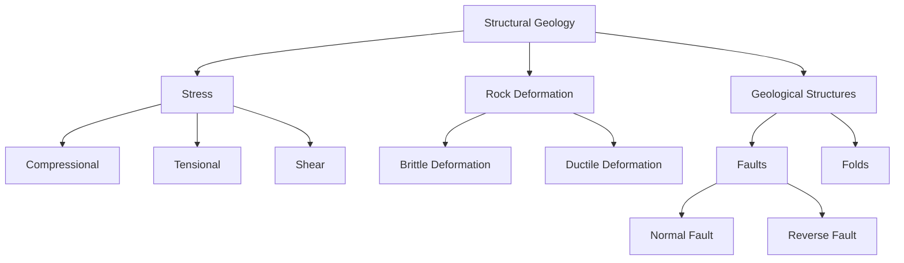

```mermaid
flowchart TD
    StructuralGeology[Structural Geology] --> Stress[Stress]
    StructuralGeology --> Strain[Rock Deformation]
    StructuralGeology --> Structures[Geological Structures]
    Stress --> Compressional[Compressional]
    Stress --> Tensional[Tensional]
    Stress --> Shear[Shear]
    Strain --> Brittle[Brittle Deformation]
    Strain --> Ductile[Ductile Deformation]
    Structures --> Faults[Faults]
    Structures --> Folds[Folds]
    Faults --> Normal[Normal Fault]
    Faults --> Reverse[Reverse Fault]
```