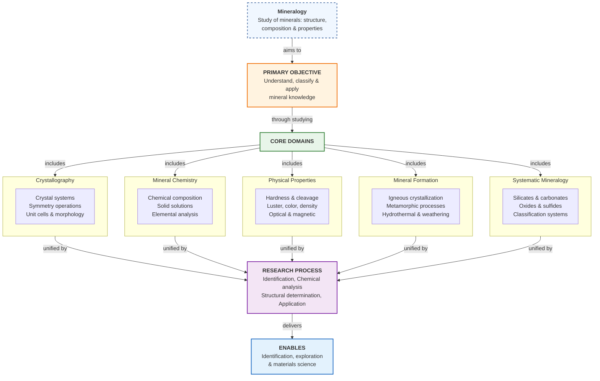

```mermaid
flowchart TD
    A[<b>Mineralogy</b><br>Study of minerals: structure,<br>composition & properties]:::title
    B[<b>PRIMARY OBJECTIVE</b><br>Understand, classify & apply<br>mineral knowledge]:::objective
    C[<b>CORE DOMAINS</b>]:::domains
    
    subgraph D[Crystallography]
        D1[Crystal systems<br>Symmetry operations<br>Unit cells & morphology]
    end
    
    subgraph E[Mineral Chemistry]
        E1[Chemical composition<br>Solid solutions<br>Elemental analysis]
    end
    
    subgraph F[Physical Properties]
        F1[Hardness & cleavage<br>Luster, color, density<br>Optical & magnetic]
    end
    
    subgraph G[Mineral Formation]
        G1[Igneous crystallization<br>Metamorphic processes<br>Hydrothermal & weathering]
    end
    
    subgraph H[Systematic Mineralogy]
        H1[Silicates & carbonates<br>Oxides & sulfides<br>Classification systems]
    end
    
    I[<b>RESEARCH PROCESS</b><br>Identification, Chemical analysis<br>Structural determination, Application]:::process
    
    J[<b>ENABLES</b><br>Identification, exploration<br>& materials science]:::outcome
    
    A -->|aims to| B
    B -->|through studying| C
    C -->|includes| D
    C -->|includes| E
    C -->|includes| F
    C -->|includes| G
    C -->|includes| H
    D & E & F & G & H -->|unified by| I
    I -->|delivers| J
    
    classDef title fill:#f0f7ff,stroke:#4a6fa5,stroke-width:2px,color:#333,stroke-dasharray: 5 5
    classDef objective fill:#fff3e0,stroke:#ef6c00,stroke-width:2px,color:#333
    classDef domains fill:#e8f5e9,stroke:#2e7d32,stroke-width:2px,color:#333
    classDef process fill:#f3e5f5,stroke:#7b1fa2,stroke-width:2px,color:#333
    classDef outcome fill:#e3f2fd,stroke:#1565c0,stroke-width:2px,color:#333
```