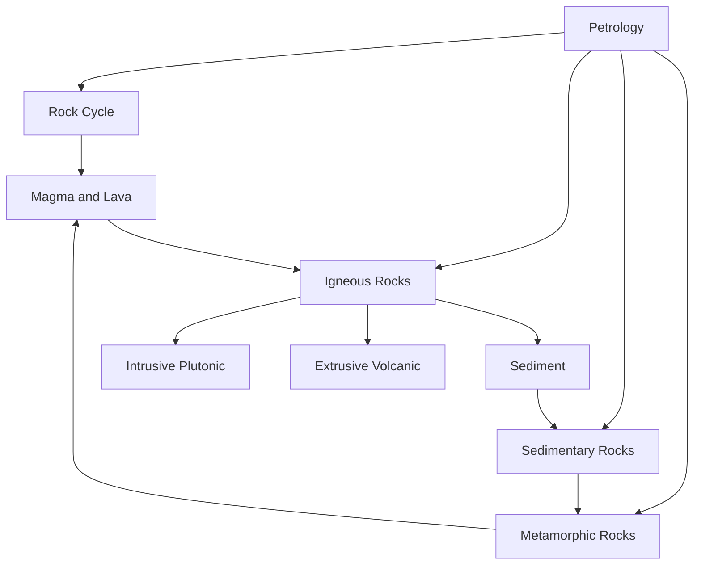

```mermaid
flowchart TD
    Petrology[Petrology] --> RockCycle[Rock Cycle]
    Petrology --> Igneous[Igneous Rocks]
    Petrology --> Sedimentary[Sedimentary Rocks]
    Petrology --> Metamorphic[Metamorphic Rocks]
    RockCycle --> Magma[Magma and Lava]
    Magma --> Igneous
    Igneous --> Sediment[Sediment]
    Sediment --> Sedimentary
    Sedimentary --> Metamorphic
    Metamorphic --> Magma
    Igneous --> Intrusive[Intrusive Plutonic]
    Igneous --> Extrusive[Extrusive Volcanic]
```