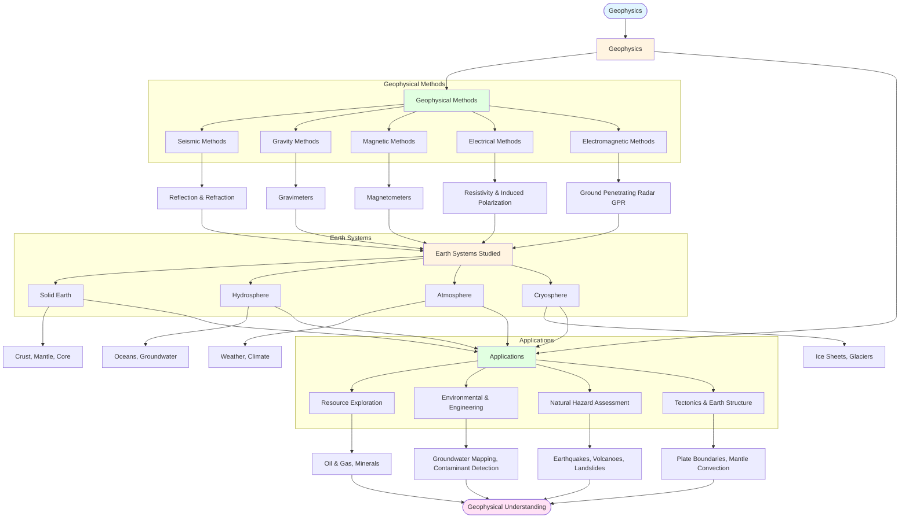

```mermaid
flowchart TD
    Start([Geophysics]) --> Geo[Geophysics]
    
    Geo --> Methods[Geophysical Methods]
    Geo --> Applications[Applications]
    
    Methods --> M1[Seismic Methods]
    Methods --> M2[Gravity Methods]
    Methods --> M3[Magnetic Methods]
    Methods --> M4[Electrical Methods]
    Methods --> M5[Electromagnetic Methods]
    
    M1 --> M1a[Reflection & Refraction]
    M2 --> M2a[Gravimeters]
    M3 --> M3a[Magnetometers]
    M4 --> M4a[Resistivity & Induced Polarization]
    M5 --> M5a[Ground Penetrating Radar GPR]
    
    M1a --> Systems[Earth Systems Studied]
    M2a --> Systems
    M3a --> Systems
    M4a --> Systems
    M5a --> Systems
    
    Systems --> E1[Solid Earth]
    Systems --> E2[Hydrosphere]
    Systems --> E3[Atmosphere]
    Systems --> E4[Cryosphere]
    
    E1 --> E1a[Crust, Mantle, Core]
    E2 --> E2a[Oceans, Groundwater]
    E3 --> E3a[Weather, Climate]
    E4 --> E4a[Ice Sheets, Glaciers]
    
    E1 --> Applications
    E2 --> Applications
    E3 --> Applications
    E4 --> Applications
    
    Applications --> A1[Resource Exploration]
    Applications --> A2[Environmental & Engineering]
    Applications --> A3[Natural Hazard Assessment]
    Applications --> A4[Tectonics & Earth Structure]
    
    A1 --> A1a[Oil & Gas, Minerals]
    A2 --> A2a[Groundwater Mapping, Contaminant Detection]
    A3 --> A3a[Earthquakes, Volcanoes, Landslides]
    A4 --> A4a[Plate Boundaries, Mantle Convection]
    
    A1a --> End([Geophysical Understanding])
    A2a --> End
    A3a --> End
    A4a --> End
    
    subgraph Methods_Group["Geophysical Methods"]
        Methods
        M1
        M2
        M3
        M4
        M5
    end
    
    subgraph Earth_Systems["Earth Systems"]
        Systems
        E1
        E2
        E3
        E4
    end
    
    subgraph Applications_Group["Applications"]
        Applications
        A1
        A2
        A3
        A4
    end
    
    style Start fill:#e1f5ff
    style End fill:#ffe1f5
    style Geo fill:#fff4e1
    style Methods fill:#e1ffe1
    style Systems fill:#fff4e1
    style Applications fill:#e1ffe1
```
