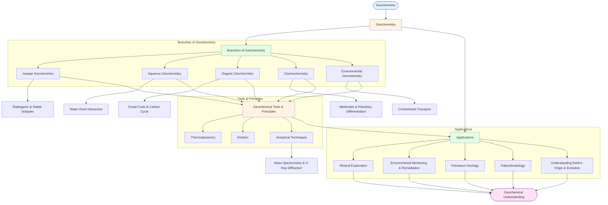

```mermaid
flowchart TD
    Start([Geochemistry]) --> GeoChem[Geochemistry]
    
    GeoChem --> Branches[Branches of Geochemistry]
    GeoChem --> Applications[Applications]
    
    Branches --> B1[Isotope Geochemistry]
    Branches --> B2[Aqueous Geochemistry]
    Branches --> B3[Organic Geochemistry]
    Branches --> B4[Cosmochemistry]
    Branches --> B5[Environmental Geochemistry]
    
    B1 --> B1a[Radiogenic & Stable Isotopes]
    B2 --> B2a[Water-Rock Interaction]
    B3 --> B3a[Fossil Fuels & Carbon Cycle]
    B4 --> B4a[Meteorites & Planetary Differentiation]
    B5 --> B5a[Contaminant Transport]
    
    B1 --> Tools[Geochemical Tools & Principles]
    B2 --> Tools
    B3 --> Tools
    B4 --> Tools
    B5 --> Tools
    
    Tools --> T1[Thermodynamics]
    Tools --> T2[Kinetics]
    Tools --> T3[Analytical Techniques]
    
    T3 --> T3a[Mass Spectrometry & X-Ray Diffraction]
    
    Tools --> Applications
    
    Applications --> A1[Mineral Exploration]
    Applications --> A2[Environmental Monitoring & Remediation]
    Applications --> A3[Petroleum Geology]
    Applications --> A4[Paleoclimatology]
    Applications --> A5[Understanding Earth's Origin & Evolution]
    
    A1 --> End([Geochemical Understanding])
    A2 --> End
    A3 --> End
    A4 --> End
    A5 --> End
    
    subgraph Branches_Group["Branches of Geochemistry"]
        Branches
        B1
        B2
        B3
        B4
        B5
    end
    
    subgraph Tools_Group["Tools & Principles"]
        Tools
        T1
        T2
        T3
    end
    
    subgraph Applications_Group["Applications"]
        Applications
        A1
        A2
        A3
        A4
        A5
    end
    
    style Start fill:#e1f5ff
    style End fill:#ffe1f5
    style GeoChem fill:#fff4e1
    style Branches fill:#e1ffe1
    style Tools fill:#fff4e1
    style Applications fill:#e1ffe1
```
