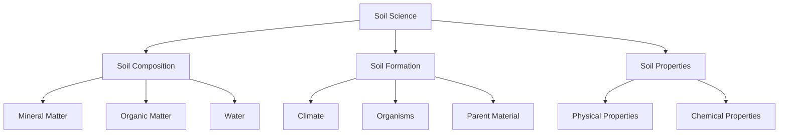

```mermaid
flowchart TD
    SoilScience[Soil Science] --> Composition[Soil Composition]
    SoilScience --> Formation[Soil Formation]
    SoilScience --> Properties[Soil Properties]
    Composition --> Mineral[Mineral Matter]
    Composition --> Organic[Organic Matter]
    Composition --> Water[Water]
    Formation --> Climate[Climate]
    Formation --> Organisms[Organisms]
    Formation --> ParentMaterial[Parent Material]
    Properties --> Physical[Physical Properties]
    Properties --> Chemical[Chemical Properties]
```