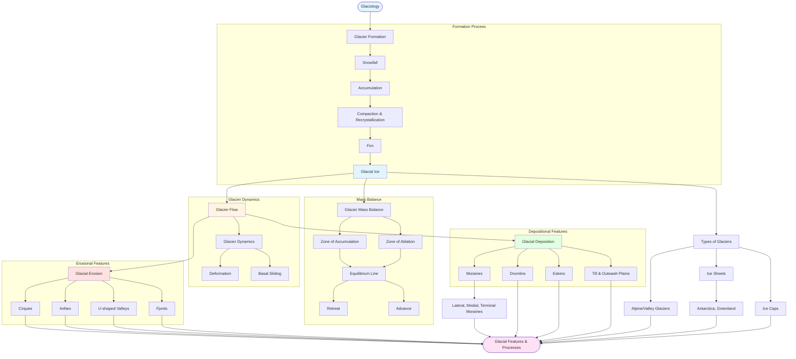

```mermaid
flowchart TD
    Start([Glaciology]) --> Formation[Glacier Formation]
    
    Formation --> S[Snowfall]
    S --> A[Accumulation]
    A --> C[Compaction & Recrystallization]
    C --> F[Firn]
    F --> GI[Glacial Ice]
    
    GI --> MassBalance[Glacier Mass Balance]
    
    MassBalance --> ZoneA[Zone of Accumulation]
    MassBalance --> ZoneB[Zone of Ablation]
    ZoneA --> Bal[Equilibrium Line]
    ZoneB --> Bal
    
    Bal --> Retreat[Retreat]
    Bal --> Advance[Advance]
    
    GI --> Flow[Glacier Flow]
    
    Flow --> Dynamics[Glacier Dynamics]
    
    Dynamics --> D[Deformation]
    Dynamics --> B[Basal Sliding]
    
    Flow --> Erosion[Glacial Erosion]
    
    Erosion --> E1[Cirques]
    Erosion --> E2[Arêtes]
    Erosion --> E3[U-shaped Valleys]
    Erosion --> E4[Fjords]
    
    Flow --> Deposition[Glacial Deposition]
    
    Deposition --> D1[Moraines]
    Deposition --> D2[Drumlins]
    Deposition --> D3[Eskers]
    Deposition --> D4[Till & Outwash Plains]
    
    D1 --> D1a[Lateral, Medial, Terminal Moraines]
    
    GI --> Types[Types of Glaciers]
    
    Types --> T1[Alpine/Valley Glaciers]
    Types --> T2[Ice Sheets]
    Types --> T3[Ice Caps]
    
    T2 --> T2a[Antarctica, Greenland]
    
    E1 --> End([Glacial Features & Processes])
    E2 --> End
    E3 --> End
    E4 --> End
    D1a --> End
    D2 --> End
    D3 --> End
    D4 --> End
    T1 --> End
    T2a --> End
    T3 --> End
    
    subgraph Formation_Process["Formation Process"]
        Formation
        S
        A
        C
        F
        GI
    end
    
    subgraph Mass_Balance["Mass Balance"]
        MassBalance
        ZoneA
        ZoneB
        Bal
        Retreat
        Advance
    end
    
    subgraph Glacier_Dynamics["Glacier Dynamics"]
        Flow
        Dynamics
        D
        B
    end
    
    subgraph Erosional_Features["Erosional Features"]
        Erosion
        E1
        E2
        E3
        E4
    end
    
    subgraph Depositional_Features["Depositional Features"]
        Deposition
        D1
        D2
        D3
        D4
    end
    
    style Start fill:#e1f5ff
    style End fill:#ffe1f5
    style GI fill:#e1f5ff
    style Flow fill:#fff4e1
    style Erosion fill:#ffe1e1
    style Deposition fill:#e1ffe1
```
