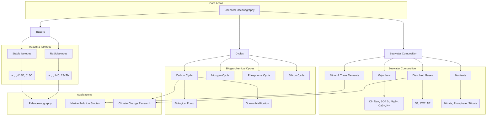

```mermaid
flowchart TD
    subgraph "Core Areas"
        CO[Chemical Oceanography]
    end

    CO --> SC[Seawater Composition] & Cycles & Tracers

    subgraph "Seawater Composition"
        Major[Major Ions] --> M1(Cl-, Na+, SO4 2-, Mg2+, Ca2+, K+)
        Minor[Minor & Trace Elements]
        Gases[Dissolved Gases] --> G1(O2, CO2, N2)
        Nutrients[Nutrients] --> N1(Nitrate, Phosphate, Silicate)
    end

    SC --> Major & Minor & Gases & Nutrients

    subgraph "Biogeochemical Cycles"
        Carbon[Carbon Cycle] --> Carb1(Biological Pump)
        Carbon --> Carb2(Ocean Acidification)
        Nitrogen[Nitrogen Cycle]
        Phosphorus[Phosphorus Cycle]
        Silicon[Silicon Cycle]
    end

    Cycles --> Carbon & Nitrogen & Phosphorus & Silicon

    subgraph "Tracers & Isotopes"
        Stable[Stable Isotopes] --> S1(e.g., δ18O, δ13C)
        Radio[Radioisotopes] --> R1(e.g., 14C, 234Th)
    end

    Tracers --> Stable & Radio

    subgraph "Applications"
        App1[Paleoceanography]
        App2[Marine Pollution Studies]
        App3[Climate Change Research]
    end

    S1 & R1 --> App1
    Minor --> App2
    Carbon & Gases --> App3
```
